# CoE-AI Lab Kolkata — Definitive Codebase & System Architecture Manual

> **Document Type**: Comprehensive Engineering & Technical Interview Reference
> **Repository**: `nilavobiswas/ailabkolkata`
> **Framework Stack**: Laravel 12.x / PHP 8.2+ / PostgreSQL / Face Recognition API / Bootstrap 5 / Vanilla JS
> **Target Location**: `Docsss/PORTAL_ARCHITECTURE_GUIDE.md`
> **Audience**: Mentors, Senior Architects, External Technical Evaluators, and Core Maintainers

---

## Table of Contents
1. [Executive Summary & Global Architecture](#1-executive-summary--global-architecture)
2. [End-to-End Visual Sequence Diagrams](#2-end-to-end-visual-sequence-diagrams)
3. [Super Admin Portal — Complete Breakdown](#3-super-admin-portal--complete-breakdown)
4. [NIC Officer Portal — Complete Breakdown](#4-nic-officer-portal--complete-breakdown)
5. [NIC Developer Portal — Complete Breakdown](#5-nic-developer-portal--complete-breakdown)
6. [Intern (Trainee) Portal — Complete Breakdown](#6-intern-trainee-portal--complete-breakdown)
7. [FRBAS (Face Recognition Biometrics) Engine](#7-frbas-face-recognition-biometrics-engine)
8. [Gate Terminals & Edge Hardware Infrastructure](#8-gate-terminals--edge-hardware-infrastructure)
9. [Public, NLP & AI POC Showcase Modules](#9-public-nlp--ai-poc-showcase-modules)
10. [Core Service & Business Logic Layer (`app/Services`)](#10-core-service--business-logic-layer-appservices)
11. [Complete Directory of All 23 Controllers](#11-complete-directory-of-all-23-controllers)
12. [Complete Directory of All 16 Eloquent Models](#12-complete-directory-of-all-16-eloquent-models)
13. [Complete Directory of All 8 Middlewares](#13-complete-directory-of-all-8-middlewares)
14. [Complete Directory of All 56 Blade Views & Partials](#14-complete-directory-of-all-56-blade-views--partials)
15. [Complete Directory of All 38 Database Migrations](#15-complete-directory-of-all-38-database-migrations)
16. [Seeders, Providers, Configs & Runtime Lifecycle](#16-seeders-providers-configs--runtime-lifecycle)
17. [Complete Route Mapping Table (`routes/web.php` & `routes/api.php`)](#17-complete-route-mapping-table-routeswebphp--routesapiphp)
18. [Top Technical Interview Questions & Answers from the Codebase](#18-top-technical-interview-questions--answers-from-the-codebase)

---

## 1. Executive Summary & Global Architecture

The **Centre of Excellence in Artificial Intelligence (CoE-AI)** application is a multi-tier enterprise web system designed for government AI operations, biometric attendance management, research Proof-of-Concepts (POCs), and personnel supervision.

### Core Metrics at a Glance
* **Controllers**: 23 (7 Admin, 2 Officer, 1 Developer, 1 Intern, 5 Biometric/Gate, 2 Core/NLP, 4 Auth, 1 Base)
* **Eloquent Models**: 16 (Handling Users, Biometrics, Audit Logs, Gate Hardware, Taxonomy, Leaves)
* **Service Classes**: 2 (`BiometricApiService`, `AttendanceCalculationService`)
* **Custom Middlewares**: 8 (Role, Stake, Hardware Key, Password Reset, FRBAS Access Gates)
* **Blade Views**: 56 (Portal pages, dashboards, terminals, modals, navigation partials)
* **Database Migrations**: 38 (PostgreSQL relational and vector-descriptor schemas)
* **Database Seeders**: 3 (`DatabaseSeeder`, `AdminUserSeeder`, `CategorySeeder`)

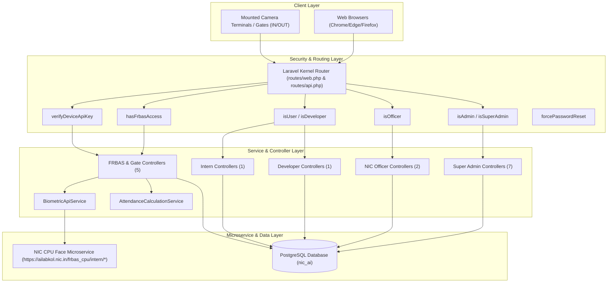

---

## 2. End-to-End Visual Sequence Diagrams

### 2.1 1:N Unattended Edge Camera Capture & Smart Punch Consolidation
This sequence illustrates unattended kiosk gates scanning incoming personnel, invoking the biometric vector matching engine, debouncing rapid scans, and pairing timestamps into work hours.

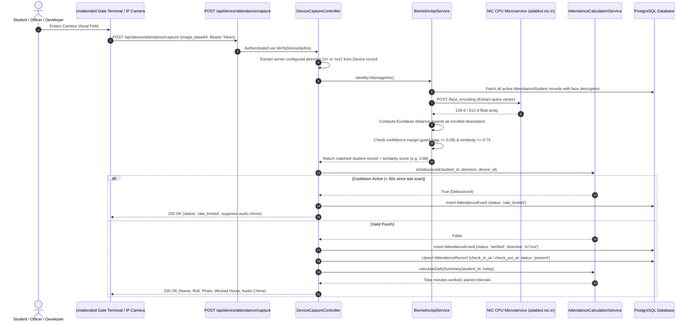

### 2.2 Biometric Face Enrollment & Audit Trail Generation
This sequence illustrates how an Admin or Officer enrolls an individual, tests image liveness, extracts mathematical descriptors, and commits an audit log.

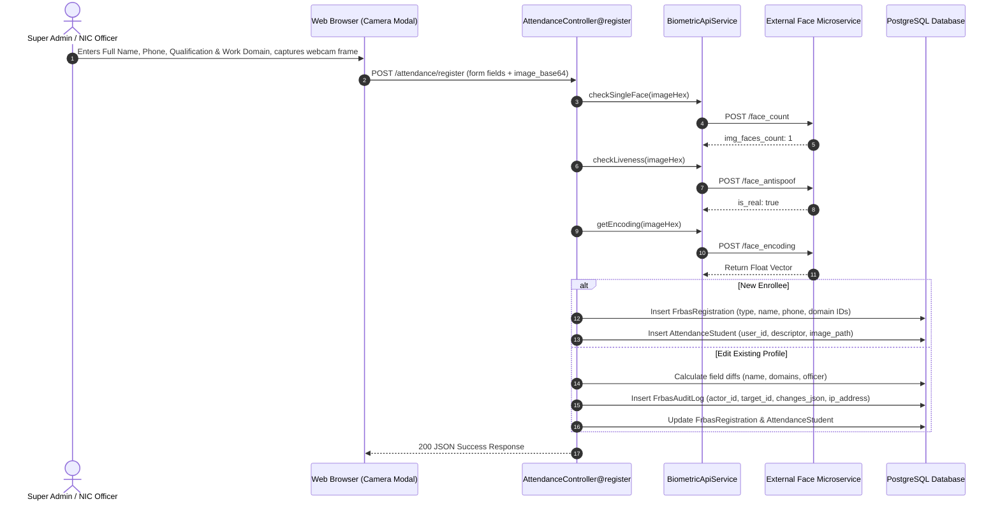

---

## 3. Super Admin Portal — Complete Breakdown

### 3.1 Architectural Scope & Authority
The Super Admin portal is the master command node of the entire application. The Super Admin has unrestricted authority over:
1. **User Identity & State Lifecycle**: Registering, vetting, approving, rejecting, and disabling accounts across all stake levels.
2. **Domain Master Taxonomy**: Managing Educational Qualifications and Project Work Domains with soft-delete safety.
3. **AI POC Repository**: Creating, editing, categorizing, and assigning personnel to Proof of Concept models.
4. **Hardware Gate Terminals**: Enrolling camera gateways, generating API credentials, and monitoring edge devices.
5. **Biometric Security Control**: Assigning FRBAS access privileges (`has_frbas_access`) to specific users.

### 3.2 Security Gate & Middleware
* **Route Prefix**: `/admin`
* **Route Name Prefix**: `admin.`
* **Middleware Chain**: `['auth', 'isAdmin']`
* **Gate Implementation**: `App\Http\Middleware\IsAdmin` verifies that `auth()->user()->role === 'admin'`. If non-admin attempts access, redirects to `home` with an error flash message.

### 3.3 Connected Controllers & Action Inventory

#### 1. `AdminUserController` (`app/Http/Controllers/Admin/AdminUserController.php`)
* **`index()`**: Fetches pending user registrations (`status = 'pending'`) for moderation, alongside approved summaries.
* **`create()`**: Displays user enrollment wizard with dynamic stake-level dropdowns.
* **`store(Request $request)`**:
  * Validates email, mobile, password, name, `stake_level_id`, and `stake_level_type_id`.
  * Hashes temporary password via `Hash::make()`.
  * Sets `status = 'approved'` and `password_changed = false`.
* **`show($id)`**: Loads full profile attributes of user `$id`, including stake levels, POC assignments, and biometric status.
* **`update($id, Request $request)`**: Updates administrative metadata, designations, and profile details.
* **`registered()`**: Renders directory of all approved users across all stake levels.
* **`approve($id)`**: Flips `status = 'approved'` and activates login rights.
* **`reject($id)`**: Flips `status = 'rejected'`.
* **`toggleActive($id)`**: Inverts `is_active` boolean (instant login kill-switch).
* **`assignFrbas($id)`**: Toggles `has_frbas_access` boolean.

#### 2. `AdminActiveUserController` (`app/Http/Controllers/Admin/AdminActiveUserController.php`)
* **`developers(Request $request)`**: Dedicated directory for `NIC Developer` stake level, with dynamic query search on name/email/phone.
* **`officers(Request $request)`**: Dedicated directory for `NIC Officer` stake level, with supervised intern counts.
* **`interns(Request $request)`**: Dedicated directory for `Intern / Trainee` stake level, with attendance health status.

#### 3. `AdminInternController` (`app/Http/Controllers/Admin/AdminInternController.php`)
* **`index()`**: Master tabular view of all registered trainees.
* **`activeOverview()`**: Real-time live intern monitoring dashboard, displaying punch in/out timestamps for the current day.
* **`show($id)`**: Detailed profile of an intern, monthly attendance calendar, and supervisor linkages.
* **`exportAttendance()`**: Generates high-speed CSV streaming download of intern attendance records across custom date windows.
* **`destroy($id)`**: Safely unlinks attendance records and removes trainee profile.

#### 4. `AdminDomainController` (`app/Http/Controllers/Admin/AdminDomainController.php`)
* **`index()`**: Unified management interface displaying both Educational Qualifications and Work Domains, with active vs soft-deleted counters.
* **`storeQualification()`**, **`updateQualification()`**, **`destroyQualification()`**, **`restoreQualification()`**: Complete CRUD with soft-delete restore capabilities for educational degrees.
* **`storeWorkDomain()`**, **`updateWorkDomain()`**, **`destroyWorkDomain()`**, **`restoreWorkDomain()`**: Complete CRUD with soft-delete restore capabilities for project domains.

#### 5. `AdminCategoryController` (`app/Http/Controllers/Admin/AdminCategoryController.php`)
* **`index()`, `create()`, `store()`, `edit()`, `update()`, `destroy()`**: CRUD operations for AI POC categories (Agriculture, Fisheries, NLP, Computer Vision).

#### 6. `AdminPocController` (`app/Http/Controllers/Admin/AdminPocController.php`)
* **`index()`, `create()`, `store()`, `edit()`, `update()`, `destroy()`**: CRUD operations for Proof-of-Concept AI Models.
* **`assignUsers($poc)`**: Synchronizes developer and officer user IDs to an AI Model via the `ai_model_user` pivot table.

#### 7. `AdminDeviceController` (`app/Http/Controllers/Admin/AdminDeviceController.php`)
* **`index()`**: Inventories all mounted edge camera terminals.
* **`store()`**: Enrolls a new physical device, generates unique `device_code` and cryptographic `api_key`.
* **`toggleStatus()`**: Enables or disables device stream ingestion.
* **`regenerateKey()`**: Re-issues a 64-character random API key (`Str::random(64)`).
* **`destroy()`**: Deletes device registration.

### 3.4 Connected Views
* `admin/home.blade.php`: Master dashboard with quick metric widgets and system navigation.
* `admin/users/create.blade.php`, `index.blade.php`, `registered.blade.php`, `show.blade.php`: User lifecycle screens.
* `admin/active_users/developers.blade.php`, `officers.blade.php`: Specialized directory pages.
* `admin/interns/active_overview.blade.php`, `index.blade.php`, `show.blade.php`: Intern supervision views.
* `admin/domains/index.blade.php`: Qualifications and Work Domains management console with modals.
* `admin/categories/index.blade.php`, `create.blade.php`, `edit.blade.php`: POC category views.
* `admin/pocs/index.blade.php`, `create.blade.php`, `edit.blade.php`: AI POC model views.
* `admin/devices/index.blade.php`: Camera hardware terminal console.
* `attendance/index-admin.blade.php`: Global attendance ledger viewer.
* `partials/navbar-app.blade.php`: Top navbar with phone chip and Super Admin quick-action dropdown menu.

---

## 4. NIC Officer Portal — Complete Breakdown

### 4.1 Architectural Scope & Authority
NIC Officers are government officials who mentor interns and supervise developers. They have authority to:
1. Supervise assigned interns and inspect their attendance percentages.
2. Review and take binding action (**Approve** or **Reject**) on leave applications submitted by both **Interns** and **Developers**.
3. Export intern attendance records for compliance and reporting.
4. Enroll developers and interns into the FRBAS biometric database under their supervisory identity.

### 4.2 Security Gate & Middleware
* **Route Prefix**: `/officer` and `/user/home`
* **Route Name Prefix**: `officer.`
* **Middleware Chain**: `['auth', 'isOfficer', 'forcePasswordReset']`
* **Gate Implementation**: `App\Http\Middleware\IsOfficer` checks if `$user->stakeLevel()->name === 'NIC Officer'`.

### 4.3 Connected Controllers & Action Inventory

#### 1. `OfficerInternController` (`app/Http/Controllers/Officer/OfficerInternController.php`)
* **`index()`**:
  * Resolves interns assigned to the authenticated officer (via `under_officer_id` in `frbas_registrations` or user relation).
  * Calculates individual attendance health (Total days, Present count, Absent count, Attendance percentage).
* **`show($id)`**: Detailed profile of an intern with punch logs and monthly attendance ledger.
* **`exportAttendance()`**: Generates CSV export containing attendance records of all interns under the officer's charge.

#### 2. `OfficerLeaveController` (`app/Http/Controllers/OfficerLeaveController.php`)
* **`inbox()`**: Tabbed leave review console:
  * **Tab 1: Pending Intern Leaves**: Applications submitted by supervised trainees.
  * **Tab 2: Pending Developer Leaves**: Applications submitted by developers under the officer's supervision.
  * **Tab 3: Historical Requests**: Completed reviews with reviewer metadata (`reviewed_by_officer_id`, `reviewed_at`).
  * *Sanitization Filter*: Applies `preg_replace('/\s*\(Audit Tested\)/i', '', $name)` across all tables to ensure clean UI presentation.
* **`approve($id)`**:
  * Sets `leaves.status = 'approved'`.
  * Sets `leaves.reviewed_by_officer_id = auth()->id()`.
  * Sets `leaves.reviewed_at = now()`.
  * Automatically upserts `attendance_records` for that date with `status = 'leave'`, preserving reporting integrity.
* **`reject($id)`**: Sets `leaves.status = 'rejected'`, records reviewer ID and timestamp.

#### 3. `HomeController@userHome` (`app/Http/Controllers/HomeController.php`)
* Directs authenticated officers to their executive dashboard (`resources/views/user/home.blade.php`).

### 4.4 Connected Views
* `officer/interns/index.blade.php`: Assigned interns grid and tabular summary.
* `officer/interns/show.blade.php`: Intern monthly attendance profile.
* `officer/leave-inbox.blade.php`: Tabbed leave management console.
* `user/home.blade.php`: Officer landing dashboard.
* `partials/navbar-user.blade.php`: Navigation bar with "My Interns", "Leave Requests", credential phone badge, and Logout.

---

## 5. NIC Developer Portal — Complete Breakdown

### 5.1 Architectural Scope & Authority
NIC Developers are engineers developing AI applications. Their portal provides:
1. An interactive **Google Calendar monthly attendance view** displaying attendance statuses.
2. Self-service leave application directly routed to their supervising officer.
3. Quick visibility of personal attendance statistics (Present, Absent, Leave Approved/Pending/Rejected, Working Days).

### 5.2 Security Gate & Middleware
* **Route Prefix**: `/developer` and `/user/home`
* **Route Name Prefix**: `developer.`
* **Middleware Chain**: `['auth', 'forcePasswordReset']`

### 5.3 Connected Controllers & Action Inventory

#### 1. `DeveloperLeaveController` (`app/Http/Controllers/DeveloperLeaveController.php`)
* **`myAttendance(Request $request)`**:
  * Resolves requested month and year (defaults to current).
  * Computes month counters: `present`, `absent`, `leave_approved`, `leave_pending`, `leave_rejected`, `working_days`, `holidays`, `sundays`, `saturdays`.
  * Resolves Developer's Supervising Officer (from previous leaves, FRBAS profile, or first officer in system).
  * Generates calendar cell array with day numbers, today flags, weekend flags, and clickability for absent days.
* **`applyLeave(Request $request)`**:
  * Validates `attendance_date` and `reason`.
  * Resolves and binds `reviewed_by_officer_id`.
  * Creates or updates pending record in `leaves` table.

#### 2. `HomeController@userHome` (`app/Http/Controllers/HomeController.php`)
* Serves developer landing dashboard.

### 5.4 Connected Views
* `developer/my-attendance.blade.php`: Interactive monthly attendance calendar with inline SVG chevrons, stats badges, leave application modal, and topbar phone credential pill.
* `user/home.blade.php`: Developer dashboard view.
* `partials/navbar-user.blade.php`: Navbar with "My Attendance & Leave" link, phone badge, and Logout.
* `partials/navbar-user-dashboard.blade.php`: FRBAS topbar with developer link and phone badge.

---

## 6. Intern (Trainee) Portal — Complete Breakdown

### 6.1 Architectural Scope & Authority
Interns and trainees undergo technical training at CoE-AI. Their portal is streamlined for clarity:
1. Interactive Google Calendar monthly attendance matrix.
2. Embedded attendance summary with 12-week activity chart.
3. One-click leave application routing to their designated mentor/officer.
4. **Auto-Healing Supervisor Link**: The system guarantees an intern is always bound to a supervising officer, preventing unassigned lockouts.

### 6.2 Security Gate & Middleware
* **Route Prefix**: `/user/home` and `/my-attendance`
* **Route Name Prefix**: `user.` / `trainee.`
* **Middleware Chain**: `['isUser', 'auth', 'forcePasswordReset']`

### 6.3 Connected Controllers & Action Inventory

#### 1. `TraineeAttendanceController` (`app/Http/Controllers/TraineeAttendanceController.php`)
* **`myAttendance(Request $request)`**:
  * Renders the Google Calendar monthly view for trainees.
  * **Auto-Healing**: Auto-resolves the intern's supervising officer from `frbas_registrations.under_officer_id`, previous `leaves.reviewed_by_officer_id`, or fallback assigned officer, guaranteeing the officer details are always available.
  * Calculates monthly counters and provides clickable modal triggers for absent dates.
* **`applyLeave(Request $request)`**:
  * Validates leave request.
  * Auto-assigns `reviewed_by_officer_id` and persists to `leaves`.

#### 2. `HomeController@userHome` (`app/Http/Controllers/HomeController.php`)
* Renders the trainee home dashboard with 12-week attendance activity chart and embedded monthly calendar.

### 6.4 Connected Views
* `user/home.blade.php`: Trainee home dashboard with embedded Google Calendar monthly view.
* `trainee/my-attendance.blade.php`: Standalone monthly attendance calendar page with SVG chevrons and phone badge topbar.
* `partials/navbar-user.blade.php`: Intern navbar: Brand, Home, phone credential pill badge, and Logout.

---

## 7. FRBAS (Face Recognition Biometrics) Engine

### 7.1 Architectural Overview
The **Face Recognition Based Attendance System (FRBAS)** is the flagship biometric engine of CoE-AI. It combines browser-side image capture, vector normalization, anti-spoofing verification, and high-dimensional vector search.

### 7.2 Microservice Architecture & External API Pipeline

The FRBAS engine interfaces with the dedicated NIC CPU vision microservice (`https://ailabkol.nic.in/frbas_cpu/intern/`) across two distinct operational paradigms: **1:1 Identity Verification** and **1:N Unprompted Identification**.

```mermaid
flowchart TD
    subgraph Enrollment ["1. Registration Stage (Dual-Write)"]
        REG_CAM["Webcam Snapshot"] --> FC1["1. /face_count (Verify 1 Face)"]
        FC1 --> AS1["2. /face_antispoof (Liveness Check)"]
        AS1 --> FE1["3. /face_encoding (Extract 512-d Vector)"]
        FE1 --> DUP["4. /face_similarity (Check DB Duplicates)"]
        DUP --> DB_SAVE["5. Save to DB (attendance_students & frbas_registrations)"]
        DB_SAVE --> EXT_REG["6. POST /face_registration\nPayload: {job_id, face_emb}\n(Enrolls into NIC CPU 1:N Container)"]
    end

    subgraph OneToOne ["2. 1:1 Face Verification (Attendance Mark)"]
        CLAIM_ID["Intern Enters Roll/Phone + Live Frame"] --> FC2["/face_count"]
        FC2 --> AS2["/face_antispoof"]
        AS2 --> FE2["/face_encoding"]
        FE2 --> SIM["/face_similarity (Compare Stored vs Live Frame)"]
        SIM --> MATCH_11["Punch Attendance if Similarity >= 0.75"]
    end

    subgraph OneToN ["3. 1:N Unprompted Identification (Web & Gate Terminals)"]
        NO_ID["Intern Walks to Camera (NO ID ENTERED)"] --> FC3["1. /face_count"]
        FC3 --> AS3["2. /face_antispoof"]
        AS3 --> IDENT["3. POST /face_identification\nPayload: {img_hex: webcam_frame}\n(Searches 1:N Container in RAM)"]
        IDENT --> RESOLVE["4. Returns matched_top1_applicant_id\nResolves AttendanceStudent in DB"]
        RESOLVE --> PUNCH["5. Records AttendanceEvent & Marks Punch\n(Debounced & Cooldown Protected)"]
        IDENT -.->|Fallback if Offline| LOCAL_SIM["Local Embedding Comparison against DB Candidates"]
    end
```

#### External Endpoints Inventory:
| Endpoint | Method | Payload | Headers | Purpose |
| :--- | :---: | :--- | :--- | :--- |
| `/face_count` | `POST` | `{"img_str": "<hex>"}` | None | Verifies exactly 1 face exists in the camera frame. |
| `/face_antispoof` | `POST` | `{"img_str": "<hex>"}` | `client_id`, `client_secret` | Detects presentation attacks (screens, paper photos). |
| `/face_encoding` | `POST` | `{"img_str": "<hex>"}` | `client_id`, `client_secret` | Generates 512-dimension vector embedding floats. |
| `/face_registration` | `POST` | `{"job_id": "24", "face_emb": "<floats>"}` | `Content-Type: application/json` | Enrolls vector into the external 1:N search container. |
| `/face_identification` | `POST` | `{"img_hex": "<hex>"}` | `Content-Type: application/json` | High-speed 1:N similarity search across container faces. |
| `/face_similarity` | `POST` | `{"emb1": "<floats>", "emb2": "<floats>"}` | None | 1:1 cosine similarity comparison between two vectors. |

### 7.3 Mathematical Models, Storage Architecture & Parameters
* **Query Vector Dimensions**: 512-dimensional float array.
* **Vector Distance Metric**: Cosine Similarity / Euclidean Distance.
* **Verification Threshold**: `0.65` (Calibrated threshold; values $\ge 0.65$ accepted as positive match).
* **Confidence Margin Guard**: `0.08` (Top match distance must exceed runner-up distance by at least $0.08$ to eliminate ambiguous matches).
* **Debounce Window**: `60 seconds` (Suppresses rapid-fire double punches on live gate terminals).
* **Sanitized Identification UX**: When face similarity is below threshold, UI returns a clean `"No matching face found in records."` notification without exposing internal candidate rosters or raw decimal scores.

### 7.4 Dual-Table Attendance Session Architecture & Multi-Punch Tracking
To accurately handle personnel moving in and out of the lab multiple times a day (e.g. morning check-in, lunch departure, lunch return, evening departure), the system employs a high-fidelity **dual-table event-sourcing model**:

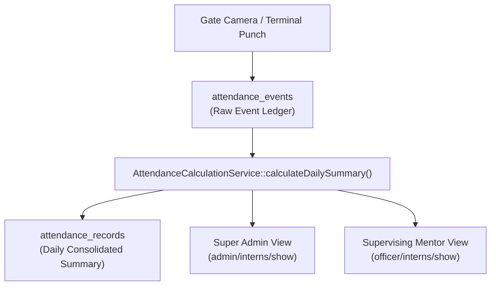

1. **Raw Event Ledger (`attendance_events`)**:
   * Stores **every single physical punch** throughout the day without overwriting history.
   * Key Fields: `id`, `attendance_student_id`, `device_id`, `match_type` (`1:1` or `1:N`), `direction` (`in` or `out`), `status` (`verified`, `rate_limited`, `unidentified`), `similarity_score`, `captured_at`.
   * **Multiple Punches**: If an intern punches 4 times a day, exactly 4 distinct immutable rows are created here.

2. **Daily Consolidated Ledger (`attendance_records`)**:
   * Stores **one summary record per student per calendar date**.
   * Key Fields: `attendance_student_id`, `user_id`, `created_at` (date), `check_in_at` (first IN of the day), `check_out_at` (latest OUT of the day), `session_name`, `similarity`.
   * Serves as the high-speed index for historical calendars, CSV export tables, and monthly attendance rosters.

3. **Multi-Punch Interval Calculation Algorithm (`AttendanceCalculationService`)**:
   * Fetches all `verified` events for a student on a specific date, ordered chronologically (`captured_at ASC`).
   * Iterates through events: sequentially pairs each `in` punch with its subsequent `out` punch to create completed working intervals:
     $$\text{Interval Duration} = t_{\text{out}} - t_{\text{in}}$$
   * Computes the cumulative daily duration:
     $$\text{Total Daily Worked Minutes} = \sum_{k=1}^{N} \text{Interval}_k$$
   * **Active Shift Tracking**: If an `in` punch is currently open without a corresponding `out` punch on the current calendar day, the service marks `is_currently_inside = true` and dynamically accumulates active running minutes up to `now()`.
   * **Anomaly Detection**: Accurately flags missing IN punches (unpaired OUT) or missing OUT punches at day-end.

4. **Mentor (Officer) & Super Admin Visibility**:
   * **Super Admin View** (`resources/views/admin/interns/show.blade.php`) and **Supervising Officer View** (`resources/views/officer/interns/show.blade.php`) both display:
     * **Total Present Today**: Exact cumulative duration formatted in hours and minutes (e.g. `6 hrs 45 mins`).
     * **First Check-in** & **Last Check-out** timestamps.
     * **Real-Time Presence Badge**: `Inside Lab` (emerald green) vs `Outside` (amber).
     * **Punch Intervals Breakdown**: Interactive chips listing each interval with start, end, and duration:
       * Interval #1: `09:15 AM → 01:10 PM (3h 55m)`
       * Interval #2: `02:00 PM → 06:15 PM (4h 15m)`

### 7.5 Connected Controllers (5)

#### 1. `FrbasController` (`app/Http/Controllers/FrbasController.php`)
* **`index()`**: Main hub dashboard with tiles for Registration, 1:1 Verification, and 1:N Identification.
* **`registration()`**: Biometric enrollment console. Prepares domain taxonomies, existing user lists, and loads recent audit logs. Features automated snapshot replacement detection that properly resets `keepExistingPhoto` to `false` when a new photo is captured or uploaded.
* **`markAttendance()`**: 1:1 Face Verification screen.
* **`publicMarkAttendance()`**: Public kiosk 1:1 verification terminal.
* **`getAuditLogs(Request $request)`**: Returns JSON audit logs of biometric profile edits for administrative auditing.

#### 2. `Attendance1NController` (`app/Http/Controllers/Attendance1NController.php`)
* **`index()`**: Fullscreen 1:N unattended recognition dashboard with auto-scan hands-free scanning.
* **`identify(Request $request)`**:
  * **Hands-Free Auto-Direction**: No manual IN/OUT selection required. Automatically treats the first face capture of the day as **Check-In (IN)** and any subsequent captures on that day as **Check-Out (OUT)**.
  * **Real-time 1:N Recognition**: Ingests frame, verifies single face and anti-spoof liveness, queries external 1:N microservice `/face_identification`, and resolves candidate student from PostgreSQL by `matched_top1_applicant_id`.
  * **Standardized Feedback Message**: Returns the exact unified status format matching 1:1 portal: `Check-in / Check-out successful for Name (Roll) | Check-in: HH:MM AM/PM | Check-out: HH:MM AM/PM | Present today: X hrs Y mins`.
  * **Duration Analytics**: Triggers `AttendanceCalculationService::calculateDailySummary()` to compute total on-campus stay duration across all daily punch intervals.

#### 3. `AttendanceController` (`app/Http/Controllers/AttendanceController.php`)
* **`register(Request $request)`**: Core enrollment API. Enforces single face detection, verifies liveness, extracts 512-d descriptor, creates/updates `FrbasRegistration` and `AttendanceStudent`, records `FrbasAuditLog`, and dispatches `job_id` + `face_emb` to external 1:N container via `/face_registration`. Properly replaces photo on disk and syncs new vector embeddings to 1:N container when editing an existing profile.
* **`mark(Request $request)`**: 1:1 verification API. Validates claimed identity (`roll_id` or `phone`) against stored descriptor using `/face_similarity`.
* **`index()`**: Global attendance logs viewer.

#### 4. `GateTerminalController` (`app/Http/Controllers/GateTerminalController.php`)
* **`showIn()`, `showOut()`**: Dedicated fullscreen kiosk screens for gate entrance/exit cameras (`/gate/in`, `/gate/out`). Configurable via `?device=GATE-CODE` linking directly to Superadmin registered devices.
* **`capture(Request $request)`**: Processes live gate frames using `identify1N()`, identifies personnel without any ID input, logs check-in or check-out in `AttendanceRecord`, and updates daily duration.

#### 5. `DeviceCaptureController` (`app/Http/Controllers/DeviceCaptureController.php`)
* Stateless hardware API endpoint for IP camera streams and external IoT devices using `identify1N()`, authenticated via device cryptographic API keys.

### 7.5 Connected Views
* `frbas/index.blade.php`: FRBAS Hub menu.
* `frbas/registration.blade.php`: Biometric face capture, profile editing, and audit drawer.
* `frbas/mark-attendance.blade.php`: 1:1 Face Verification screen.
* `frbas/identify-1n.blade.php`: 1:N Face Identification console with automated hands-free direction banner and live candidate ranking.
* `gate/terminal.blade.php`: Fullscreen unattended kiosk terminal with animated scanning reticle.
* `admin/login.blade.php`: Login page with interactive informational tooltips on Public Biometric Terminals (`1:1 Kiosk`, `Gate IN`, `Gate OUT`).
* `partials/navbar-user-dashboard.blade.php`: FRBAS topbar with phone badge and quick links.

---

## 8. Gate Terminals & Edge Hardware Infrastructure

### 8.1 Stateless Device Gateway Architecture
To support physical hardware camera kiosks deployed at building entry and exit points, the system provides a stateless REST API secured by cryptographic hardware keys.

* **API Route**: `POST /api/device/attendance/capture`
* **Controller**: `DeviceCaptureController@capture`
* **Middleware**: `verifyDeviceApiKey`
* **Database Table**: `devices`

### 8.2 Authentication Protocol
1. Each camera terminal possesses a unique `device_code` (e.g. `GATE-IN-01`) and a 64-character `api_key`.
2. Hardware sends HTTP request with header: `Authorization: Bearer <API_KEY>` or `X-Device-Api-Key: <API_KEY>`.
3. `VerifyDeviceApiKey` queries `Device::where('api_key', $key)->where('is_active', true)->first()`.
4. If valid, attaches device instance to `$request->attributes->set('authenticated_device', $device)`.
5. Device direction (`in` or `out`) is strictly server-owned from the database record, preventing client spoofing.

---

## 9. Public, NLP & AI POC Showcase Modules

### 9.1 Public Showcase
* **`HomeController@index`**: Public portal home page (`resources/views/home.blade.php`) detailing CoE-AI lab initiatives, product showcases, and portal login launchers.
* **`HomeController@showModel`**, **`showDemo`**, **`predict`**: Interactive testing sandboxes for AI models (Computer Vision, Animal Husbandry, Fisheries).

### 9.2 NLP Tools Module
* **`NlpToolsController` (`app/Http/Controllers/NlpToolsController.php`)**:
  * `mcq()` (`resources/views/nlp/mcq.blade.php`): Multiple Choice Question evaluation tool.
  * `shortAnswer()` (`resources/views/nlp/short-answer.blade.php`): Automated short answer grading tool.
  * `qna()` (`resources/views/nlp/qna.blade.php`): Question and Answer extraction engine.

---

## 10. Core Service & Business Logic Layer (`app/Services`)

The application isolates complex business algorithms into two dedicated service classes:

### 10.1 `BiometricApiService` (`app/Services/BiometricApiService.php`)

```
App\Services\BiometricApiService
├── Properties:
│   ├── clientId / clientSecret (API Credentials)
│   ├── countUrl: https://ailabkol.nic.in/frbas_cpu/intern/face_count
│   ├── antispoofUrl: https://ailabkol.nic.in/frbas_cpu/intern/face_antispoof
│   ├── encodingUrl: https://ailabkol.nic.in/frbas_cpu/intern/face_encoding
│   ├── similarityUrl: https://ailabkol.nic.in/frbas_cpu/intern/face_similarity
│   ├── timeout: 60 seconds
│   ├── similarityThreshold: 0.75
│   └── confidenceMargin: 0.08
└── Methods:
    ├── authHeaders(): array
    ├── callApi(string $url, array $payload): array
    ├── checkSingleFace(string $imageHex): void
    ├── ensureSingleFace(array $response): void
    ├── checkLiveness(string $imageHex): void
    ├── getEncoding(string $imageHex): array
    ├── compareSimilarity(string $imageHex1, string $imageHex2): float
    └── identify1N(string $imageHex): array
```

#### Detailed Method Behaviors:
* **`ensureSingleFace()`**: Normalizes varying JSON keys returned by different face detection model versions (`img_faces_count`, `face_count`, `count`, `no_of_faces`). Throws exception if faces != 1.
* **`checkLiveness()`**: Evaluates anti-spoofing score from CPU microservice. Blocks paper printouts and screen replays.
* **`identify1N()`**:
  1. Calls `/face_encoding` to extract query image vector.
  2. Queries `AttendanceStudent::whereNotNull('face_descriptor')->get()`.
  3. Computes Euclidean distances across all enrolled descriptors.
  4. Identifies top candidate ($C_1$) and runner-up ($C_2$).
  5. Validates $Similarity(C_1) \ge 0.75$ and $[Similarity(C_1) - Similarity(C_2)] \ge 0.08$.
  6. Returns verified candidate model or rejects with failure reason.

---

### 10.2 `AttendanceCalculationService` (`app/Services/AttendanceCalculationService.php`)

```
App\Services\AttendanceCalculationService
├── Properties:
│   └── debounceSeconds: 60 seconds
└── Methods:
    ├── isDebounced(int $studentId, string $direction, ?int $deviceId): bool
    └── calculateDailySummary(int $studentId, ?string $date): array
```

#### Detailed Method Behaviors:
* **`isDebounced()`**: Checks if an identical punch occurred within the last 60 seconds for the same person and direction. Prevents double-punching when an individual lingers in front of the camera.
* **`calculateDailySummary()`**:
  * Strictly calculated in `Asia/Kolkata` timezone.
  * Fetches chronological `AttendanceEvent` records for the student on the target date.
  * Pairs sequential `IN` and `OUT` events into completed intervals.
  * Detects open intervals (missing OUT punch or missing IN punch).
  * Computes total net worked minutes and returns formatted string (`X hrs Y mins`).

---

## 11. Complete Directory of All 23 Controllers

| # | Controller Class | Full Path | Namespace | Primary Purpose |
| :--- | :--- | :--- | :--- | :--- |
| 1 | `AdminUserController` | `app/Http/Controllers/Admin/AdminUserController.php` | `App\Http\Controllers\Admin` | Full lifecycle management of users, approvals, active toggles, role assignments. |
| 2 | `AdminActiveUserController` | `app/Http/Controllers/Admin/AdminActiveUserController.php` | `App\Http\Controllers\Admin` | Dedicated active personnel directories for Developers, Officers, and Interns. |
| 3 | `AdminInternController` | `app/Http/Controllers/Admin/AdminInternController.php` | `App\Http\Controllers\Admin` | Intern master registry, real-time live attendance monitoring, and CSV export. |
| 4 | `AdminDomainController` | `app/Http/Controllers/Admin/AdminDomainController.php` | `App\Http\Controllers\Admin` | Full CRUD and soft-delete restore for Qualifications and Work Domains. |
| 5 | `AdminCategoryController` | `app/Http/Controllers/Admin/AdminCategoryController.php` | `App\Http\Controllers\Admin` | CRUD operations for AI Model / POC categories. |
| 6 | `AdminPocController` | `app/Http/Controllers/Admin/AdminPocController.php` | `App\Http\Controllers\Admin` | CRUD operations for Proof-of-Concept AI Models and user bindings. |
| 7 | `AdminDeviceController` | `app/Http/Controllers/Admin/AdminDeviceController.php` | `App\Http\Controllers\Admin` | Hardware camera device enrollment, API key generation, and status toggles. |
| 8 | `OfficerInternController` | `app/Http/Controllers/Officer/OfficerInternController.php` | `App\Http\Controllers\Officer` | Supervised intern roster, attendance stats calculation, and CSV export. |
| 9 | `OfficerLeaveController` | `app/Http/Controllers/OfficerLeaveController.php` | `App\Http\Controllers` | Tabbed leave review inbox (Intern Pending, Dev Pending, History) & approvals. |
| 10 | `DeveloperLeaveController` | `app/Http/Controllers/DeveloperLeaveController.php` | `App\Http\Controllers` | Google Calendar monthly attendance matrix, supervisor auto-binding, leave apply. |
| 11 | `TraineeAttendanceController`| `app/Http/Controllers/TraineeAttendanceController.php` | `App\Http\Controllers` | Intern Google Calendar view, supervisor auto-healing, and leave apply. |
| 12 | `FrbasController` | `app/Http/Controllers/FrbasController.php` | `App\Http\Controllers` | FRBAS Hub, biometric registration screen, 1:1 verification, audit logs API. |
| 13 | `Attendance1NController` | `app/Http/Controllers/Attendance1NController.php` | `App\Http\Controllers` | Fullscreen 1:N unattended recognition terminal and Euclidean matching. |
| 14 | `AttendanceController` | `app/Http/Controllers/AttendanceController.php` | `App\Http\Controllers` | Biometric enrollment backend API, 1:1 similarity API, and ledger display. |
| 15 | `DeviceCaptureController` | `app/Http/Controllers/DeviceCaptureController.php` | `App\Http\Controllers` | Stateless REST API handling camera frame pushes from edge gate hardware. |
| 16 | `GateTerminalController` | `app/Http/Controllers/GateTerminalController.php` | `App\Http\Controllers` | Public unattended gate terminals (IN and OUT) with animated scanner reticle. |
| 17 | `HomeController` | `app/Http/Controllers/HomeController.php` | `App\Http\Controllers` | Public landing page, user home dashboard, and AI model sandbox demos. |
| 18 | `NlpToolsController` | `app/Http/Controllers/NlpToolsController.php` | `App\Http\Controllers` | Interactive NLP evaluation tools (MCQ, Short Answer, QnA). |
| 19 | `LoginController` | `app/Http/Controllers/Auth/LoginController.php` | `App\Http\Controllers\Auth` | User authentication, CAPTCHA validation, role redirect routing, logout. |
| 20 | `CaptchaController` | `app/Http/Controllers/Auth/CaptchaController.php` | `App\Http\Controllers\Auth` | Generates dynamic mathematical SVG CAPTCHAs stored in session. |
| 21 | `PasswordChangeController` | `app/Http/Controllers/Auth/PasswordChangeController.php` | `App\Http\Controllers\Auth` | Enforces mandatory password resets on initial temporary login. |
| 22 | `RegisterController` | `app/Http/Controllers/Auth/RegisterController.php` | `App\Http\Controllers\Auth` | Redirects public registration attempts (admin-only provisioning). |
| 23 | `Controller` | `app/Http/Controllers/Controller.php` | `App\Http\Controllers` | Base controller class inheriting Laravel foundation. |

---

## 12. Complete Directory of All 16 Eloquent Models

| # | Model Class | Table Name | Key Attributes & Fillable Fields | Eloquent Relationships & Methods |
| :--- | :--- | :--- | :--- | :--- |
| 1 | **`User`** | `users` | `name`, `email`, `password`, `phone`, `role`, `status`, `is_active`, `has_frbas_access`, `password_changed`, `stake_level_id`, `stake_level_type_id` | `stakeLevel()`, `stakeLevelType()`, `attendanceRecords()`, `leaves()`, `frbasRegistration()`, `isAdmin()`, `isSuperAdmin()`, `isApproved()`, `isPending()` |
| 2 | **`StakeLevel`** | `stake_levels` | `name` (`NIC Officer`, `NIC Developer`, `Intern / Trainee`), `slug`, `order` | `users()`, `types()` |
| 3 | **`StakeLevelType`** | `stake_level_types` | `stake_level_id`, `name`, `slug` | `stakeLevel()`, `users()` |
| 4 | **`Leave`** | `leaves` | `user_id`, `attendance_date`, `reason`, `status` (`pending`, `approved`, `rejected`), `reviewed_by_officer_id`, `reviewed_at` | `user()`, `reviewer()` (`belongsTo(User, 'reviewed_by_officer_id')`) |
| 5 | **`AttendanceRecord`** | `attendance_records` | `attendance_student_id`, `user_id`, `attendance_date`, `status` (`present`, `absent`, `leave`), `check_in_at`, `check_out_at`, `device_id` | `student()`, `user()`, `device()` |
| 6 | **`AttendanceStudent`** | `attendance_students` | `user_id`, `frbas_registration_id`, `name`, `roll_id`, `department`, `face_descriptor` (TEXT/JSON vector), `image_path`, `is_identifiable_1n` | `user()`, `frbasRegistration()`, `attendanceRecords()`, `attendanceEvents()` |
| 7 | **`AttendanceEvent`** | `attendance_events` | `attendance_student_id`, `device_id`, `match_type` (`1:N`, `1:1`), `direction` (`in`, `out`), `status` (`verified`, `rate_limited`, `service_error`), `similarity_score`, `captured_at` | `student()`, `device()` |
| 8 | **`FrbasRegistration`** | `frbas_registrations` | `type` (`nic_officer`, `nic_developer`, `intern`), `name`, `phone`, `email`, `gender`, `designation`, `qualification_domain_id`, `work_domain_id`, `under_officer_id` | `qualificationDomain()`, `workDomain()`, `underOfficer()`, `attendanceStudent()` |
| 9 | **`FrbasAuditLog`** | `frbas_audit_logs` | `actor_id`, `target_registration_id`, `action` (`create`, `update`, `delete`), `old_values` (JSON), `new_values` (JSON), `ip_address`, `user_agent` | `actor()` (`belongsTo(User, 'actor_id')`), `targetRegistration()` |
| 10 | **`FrbasSubmission`** | `frbas_submissions` | `session_id`, `payload` (JSON), `status` | Temporary staging table for biometric enrollment payloads |
| 11 | **`QualificationDomain`** | `qualification_domains` | `name` (e.g. B.Tech, M.Tech, MCA), `code`, `order`, `deleted_at` | `SoftDeletes`, `frbasRegistrations()` |
| 12 | **`WorkDomain`** | `work_domains` | `name` (e.g. AI/ML, Web Development, IoT), `code`, `order`, `deleted_at` | `SoftDeletes`, `frbasRegistrations()` |
| 13 | **`Category`** | `categories` | `name`, `slug`, `icon`, `order` | `aiModels()` (`hasMany(AiModel)`) |
| 14 | **`AiModel`** | `ai_models` | `category_id`, `name`, `description`, `problem_statement`, `methodology`, `architecture`, `order` | `category()`, `users()` (`belongsToMany(User, 'ai_model_user')`) |
| 15 | **`Device`** | `devices` | `device_code`, `name`, `location`, `direction` (`in`, `out`, `bidirectional`), `api_key`, `is_active`, `last_ping_at` | `attendanceEvents()`, `attendanceRecords()` |
| 16 | **`OtpVerification`** | `otp_verifications` | `phone`, `otp`, `expires_at`, `is_verified` | Phone verification transaction ledger |

---

## 13. Complete Directory of All 8 Middlewares

| # | Middleware | Class Path | Code Behavior & Redirection Rules |
| :--- | :--- | :--- | :--- |
| 1 | **`IsAdmin`** | `App\Http\Middleware\IsAdmin` | Checks `auth()->check() && auth()->user()->role === 'admin'`. If false, redirects to `home` with error. |
| 2 | **`IsSuperAdmin`** | `App\Http\Middleware\IsSuperAdmin` | Checks if user is admin AND email matches `config('auth.superadmin_email', 'nic@admin')`. |
| 3 | **`IsOfficer`** | `App\Http\Middleware\IsOfficer` | Checks `$user->stakeLevel()->first()?->name === 'NIC Officer'` or `isAdmin()`. If unauthorized, redirects to `home`. |
| 4 | **`IsDeveloper`** | `App\Http\Middleware\IsDeveloper` | Checks `$user->stakeLevel()->first()?->name === 'NIC Developer'`. |
| 5 | **`IsUser`** | `App\Http\Middleware\IsUser` | Ensures user is authenticated and is NOT an admin (prevents admins from entering trainee home). |
| 6 | **`HasFrbasAccess`** | `App\Http\Middleware\HasFrbasAccess` | Allows entry if user is Admin OR `has_frbas_access == true`. Protects `/frbas/*` and `/attendance/*`. |
| 7 | **`ForcePasswordReset`** | `App\Http\Middleware\ForcePasswordReset` | Intercepts users where `password_changed == false` and forces redirect to `/password/force-reset`. |
| 8 | **`VerifyDeviceApiKey`** | `App\Http\Middleware\VerifyDeviceApiKey` | Reads Bearer token or `X-Device-Api-Key`, validates against `Device::where('api_key', $key)->where('is_active', true)`. Returns 401 on failure. |

---

## 14. Complete Directory of All 56 Blade Views & Partials

```
resources/views/
├── admin/
│   ├── active_users/
│   │   ├── developers.blade.php        (NIC Developer directory with query filters)
│   │   └── officers.blade.php          (NIC Officer directory with intern counters)
│   ├── categories/
│   │   ├── create.blade.php            (Form to add AI POC category)
│   │   ├── edit.blade.php              (Form to edit AI POC category)
│   │   └── index.blade.php             (Tabular list of POC categories)
│   ├── devices/
│   │   └── index.blade.php             (Camera hardware devices console)
│   ├── domains/
│   │   └── index.blade.php             (Qualifications & Work Domains console with modals)
│   ├── home.blade.php                  (Super Admin Command Center)
│   ├── interns/
│   │   ├── active_overview.blade.php   (Live intern monitoring dashboard)
│   │   ├── index.blade.php             (Intern master registry)
│   │   └── show.blade.php              (Single intern attendance profile)
│   ├── login.blade.php                 (Admin login view)
│   ├── pocs/
│   │   ├── create.blade.php            (AI Model / POC creation form)
│   │   ├── edit.blade.php              (AI Model / POC editor form)
│   │   └── index.blade.php             (AI Model repository listing)
│   └── users/
│       ├── create.blade.php            (Multi-field user registration form)
│       ├── index.blade.php             (Pending user approval queue)
│       ├── registered.blade.php        (Approved users master directory)
│       └── show.blade.php              (User profile inspector & privilege toggles)
├── attendance/
│   ├── index-admin.blade.php           (Administrative attendance ledger)
│   ├── index.blade.php                 (General attendance view)
│   └── partials/
│       └── form.blade.php              (Attendance filter component)
├── auth/
│   └── passwords/
│       └── force-reset.blade.php       (Mandatory password reset screen)
├── developer/
│   └── my-attendance.blade.php         (Google Calendar monthly attendance view for Devs)
├── frbas/
│   ├── identify-1n.blade.php           (1:N Face Identification terminal)
│   ├── index.blade.php                 (FRBAS Hub landing menu)
│   ├── mark-attendance.blade.php       (1:1 Face Verification screen)
│   ├── pdf.blade.php                   (PDF export template)
│   ├── public-mark-attendance.blade.php(Public kiosk 1:1 verification terminal)
│   └── registration.blade.php          (Biometric face capture & audit log drawer)
├── gate/
│   └── terminal.blade.php              (Unattended gate kiosk screen with scan reticle)
├── home.blade.php                      (Public landing page)
├── layouts/
│   ├── admin.blade.php                 (Super Admin layout frame)
│   ├── app.blade.php                   (Standard authenticated portal layout)
│   ├── auth.blade.php                  (Authentication & minimal layout)
│   └── frbas.blade.php                 (FRBAS & biometric terminal layout)
├── models/
│   ├── create.blade.php                (Model creation template)
│   ├── demo.blade.php                  (Model demo testing sandbox)
│   ├── fisheries/show.blade.php        (Fisheries AI model showcase)
│   └── show.blade.php                  (AI model architecture detail)
├── nlp/
│   ├── mcq.blade.php                   (MCQ generation tool)
│   ├── qna.blade.php                   (QnA extraction tool)
│   └── short-answer.blade.php          (Short answer evaluation tool)
├── officer/
│   ├── interns/
│   │   ├── index.blade.php             (Supervised interns roster card grid)
│   │   └── show.blade.php              (Intern attendance profile card)
│   └── leave-inbox.blade.php           (Tabbed leave review inbox for Interns & Devs)
├── partials/
│   ├── footer.blade.php                (Global site footer)
│   ├── navbar-app.blade.php            (Super Admin navbar with quick dropdown)
│   ├── navbar-auth.blade.php           (Authentication topbar with phone badge)
│   ├── navbar-frbas-user.blade.php     (Lightweight FRBAS header with phone badge)
│   ├── navbar-home.blade.php           (Public visitor navbar)
│   ├── navbar-user-dashboard.blade.php (Fixed FRBAS navigation with phone badge)
│   └── navbar-user.blade.php           (Officer / Developer / Intern dynamic navbar)
├── trainee/
│   └── my-attendance.blade.php         (Standalone monthly attendance calendar for Interns)
├── user/
│   └── home.blade.php                  (Intern/Officer home dashboard with embedded calendar)
└── welcome.blade.php                   (Legacy welcome view)
```

---

## 15. Complete Directory of All 38 Database Migrations

| # | Migration File | Schema Changes & Columns Added |
| :--- | :--- | :--- |
| 1 | `0001_01_01_000000_create_users_table.php` | Creates `users`, `password_reset_tokens`, `sessions`. Base auth fields (`name`, `email`, `password`, `role`, `status`). |
| 2 | `0001_01_01_000001_create_cache_table.php` | Creates `cache` and `cache_locks` for application caching. |
| 3 | `0001_01_01_000002_create_jobs_table.php` | Creates `jobs`, `job_batches`, `failed_jobs` queue tables. |
| 4 | `2026_04_02_080251_create_otp_verifications_table.php` | Creates `otp_verifications` table (`phone`, `otp`, `expires_at`, `is_verified`). |
| 5 | `2026_04_06_084000_add_columns_to_otp_verifications_table.php` | Adds verification attempts and session metadata to OTP table. |
| 6 | `2026_04_06_091500_alter_otp_column_length_in_otp_verifications_table.php` | Expands OTP column length to accommodate variable string tokens. |
| 7 | `2026_04_07_000000_add_registration_fields_to_users_table.php` | Adds `phone`, `address`, `dob`, `gender`, `designation` to `users`. |
| 8 | `2026_04_08_074712_create_categories_table.php` | Creates `categories` table (`name`, `slug`, `icon`, `order`). |
| 9 | `2026_04_08_130000_create_ai_models_table.php` | Creates `ai_models` table (`category_id`, `name`, `description`). |
| 10 | `2026_04_09_000001_add_poc_fields_to_ai_models_table.php` | Adds `problem_statement`, `methodology`, `architecture` to `ai_models`. |
| 11 | `2026_04_09_000002_convert_ai_model_image_columns_to_text.php` | Converts image path columns to `TEXT` to support base64 and deep URIs. |
| 12 | `2026_04_16_065545_update_gender_column_in_users_table.php` | Normalizes gender enum values to `male`, `female`, `other`. |
| 13 | `2026_04_16_072106_add_is_active_to_users_table.php` | Adds `is_active` (boolean, default true) to `users`. |
| 14 | `2026_05_14_100000_create_frbas_submissions_table.php` | Creates `frbas_submissions` table for temporary biometric payloads. |
| 15 | `2026_05_14_110000_update_frbas_submissions_session_id_index.php` | Adds index on `session_id` in `frbas_submissions` for fast lookups. |
| 16 | `2026_05_21_120000_add_frbas_payload_columns.php` | Adds parsed payload and verification status columns to submissions. |
| 17 | `2026_06_01_000000_create_ai_model_user_table.php` | Creates `ai_model_user` pivot table (`user_id`, `ai_model_id`). |
| 18 | `2026_06_01_120000_create_attendance_students_table.php` | Creates `attendance_students` (`user_id`, `name`, `roll_id`, `face_descriptor`). |
| 19 | `2026_06_01_120100_create_attendance_records_table.php` | Creates `attendance_records` (`student_id`, `attendance_date`, `status`). |
| 20 | `2026_06_03_000000_add_password_changed_to_users_table.php` | Adds `password_changed` (boolean, default false) to enforce initial reset. |
| 21 | `2026_06_05_000000_add_check_in_out_to_attendance_records.php` | Adds `check_in_at` and `check_out_at` timestamps to `attendance_records`. |
| 22 | `2026_09_01_000001_add_frbas_access_to_users_table.php` | Adds `has_frbas_access` (boolean, default false) to `users`. |
| 23 | `2026_09_01_000002_create_stake_level_master_tables.php` | Creates `stake_levels` and `stake_level_types` master tables. |
| 24 | `2026_09_01_000003_add_stake_level_id_to_users_table.php` | Adds `stake_level_id` foreign key constraint to `users`. |
| 25 | `2026_09_01_000004_drop_legacy_stake_level_string_columns.php` | Drops unnormalized legacy text columns for stake levels. |
| 26 | `2026_09_01_000005_add_stake_level_type_id_to_users_table.php` | Adds `stake_level_type_id` foreign key constraint to `users`. |
| 27 | `2026_09_03_192530_create_frbas_registrations_table.php` | Creates `frbas_registrations` table (`type`, `name`, `phone`, `email`). |
| 28 | `2026_09_03_200000_add_frbas_registration_id_to_attendance_students.php` | Binds `frbas_registration_id` foreign key to `attendance_students`. |
| 29 | `2026_09_03_210000_create_leaves_table.php` | Creates `leaves` table (`user_id`, `attendance_date`, `reason`, `status`). |
| 30 | `2026_09_03_220000_create_qualification_domains_table.php` | Creates `qualification_domains` master table (`name`, `code`, `order`). |
| 31 | `2026_09_03_220001_create_work_domains_table.php` | Creates `work_domains` master table (`name`, `code`, `order`). |
| 32 | `2026_09_03_220002_add_domain_ids_to_frbas_registrations.php` | Adds `qualification_domain_id` and `work_domain_id` to `frbas_registrations`. |
| 33 | `2026_09_08_130000_create_devices_table.php` | Creates `devices` table (`device_code`, `api_key`, `direction`, `is_active`). |
| 34 | `2026_09_08_130001_create_attendance_events_table.php` | Creates `attendance_events` raw punch stream table. |
| 35 | `2026_09_08_130002_add_is_identifiable_1n_to_attendance_students.php` | Adds `is_identifiable_1n` flag to `attendance_students`. |
| 36 | `2026_09_10_120000_add_reviewed_by_officer_id_to_leaves_table.php` | Adds `reviewed_by_officer_id` and `reviewed_at` to `leaves`. |
| 37 | `2026_09_11_210000_add_soft_deletes_to_qualification_and_work_domains.php` | Adds `deleted_at` timestamp columns for soft deletes. |
| 38 | `2026_09_11_220000_create_frbas_audit_logs_table.php` | Creates `frbas_audit_logs` table (`actor_id`, `action`, `changes_json`, `ip_address`). |

---

## 16. Seeders, Providers, Configs & Runtime Lifecycle

### 16.1 Seeders (`database/seeders`)
* **`AdminUserSeeder`**: Seeds the master Super Admin user:
  ```php
  User::updateOrCreate(
      ['email' => 'nic@admin'],
      [
          'name' => 'NIC Admin',
          'password' => Hash::make('123'),
          'phone' => '9876500001',
          'status' => 'approved',
          'role' => 'admin',
      ]
  );
  ```
* **`CategorySeeder`**: Seeds the 12 default government AI operational categories (AI In Agriculture, Animal Resources, Fisheries, Biometry / Face Recognition, Environment / PHE, Smart Traffic, NLP Services, Healthcare, etc.).
* **`DatabaseSeeder`**: Master seeder invoking `AdminUserSeeder` and `CategorySeeder`.

### 16.2 Providers & View Composers (`app/Providers/AppServiceProvider.php`)
* **Global View Composer**:
  Injects active AI categories and their associated models into `partials.navbar-auth` so navigation dropdowns reflect live database POCs without redundant controller queries.

### 16.3 Configuration Keys
* `config/auth.php`: `superadmin_email => env('SUPERADMIN_EMAIL', 'nic@admin')`
* `config/services.php`:
  * `frbas.client_id`, `frbas.client_secret`
  * `frbas.face_count_url`, `frbas.face_antispoof_url`, `frbas.face_encoding_url`, `frbas.face_similarity_url`
  * `frbas.similarity_threshold` (Default `0.65`)
  * `frbas.confidence_margin` (Default `0.08`)
  * `frbas.debounce_seconds` (Default `60`)

---

## 17. Complete Route Mapping Table (`routes/web.php` & `routes/api.php`)

| Method | URI | Name | Action / Controller | Middleware Stack |
| :--- | :--- | :--- | :--- | :--- |
| `GET` | `/` | `home` | `HomeController@index` | Public |
| `GET` | `/login` | `login.show` | `LoginController@showLoginForm` | Public |
| `POST` | `/login` | `login.store` | `LoginController@login` | Public |
| `GET` | `/captcha.svg` | `captcha.svg` | `CaptchaController@svg` | Public |
| `POST` | `/logout` | `logout` | `LoginController@logout` | `auth` |
| `GET` | `/user/home` | `user.home` | `HomeController@userHome` | `isUser`, `forcePasswordReset` |
| `GET` | `/my-attendance` | `trainee.my-attendance` | `TraineeAttendanceController@myAttendance`| `auth`, `forcePasswordReset` |
| `POST` | `/leave/apply` | `trainee.leave.apply` | `TraineeAttendanceController@applyLeave` | `auth`, `forcePasswordReset` |
| `GET` | `/developer/my-attendance` | `developer.my-attendance` | `DeveloperLeaveController@myAttendance` | `auth`, `forcePasswordReset` |
| `POST` | `/developer/leave/apply` | `developer.leave.apply` | `DeveloperLeaveController@applyLeave` | `auth`, `forcePasswordReset` |
| `GET` | `/officer/interns` | `officer.interns.index` | `Officer\OfficerInternController@index` | `auth`, `isOfficer`, `forcePasswordReset` |
| `GET` | `/officer/interns/{id}` | `officer.interns.show` | `Officer\OfficerInternController@show` | `auth`, `isOfficer`, `forcePasswordReset` |
| `GET` | `/officer/interns/export` | `officer.interns.export` | `Officer\OfficerInternController@exportAttendance` | `auth`, `isOfficer`, `forcePasswordReset` |
| `GET` | `/officer/leave` | `officer.leave.inbox` | `OfficerLeaveController@inbox` | `auth`, `isOfficer`, `forcePasswordReset` |
| `POST` | `/officer/leave/{id}/approve` | `officer.leave.approve` | `OfficerLeaveController@approve` | `auth`, `isOfficer`, `forcePasswordReset` |
| `POST` | `/officer/leave/{id}/reject` | `officer.leave.reject` | `OfficerLeaveController@reject` | `auth`, `isOfficer`, `forcePasswordReset` |
| `GET` | `/frbas` | `frbas.index` | `FrbasController@index` | `hasFrbasAccess`, `forcePasswordReset` |
| `GET` | `/frbas/registration` | `frbas.registration` | `FrbasController@registration` | `hasFrbasAccess`, `forcePasswordReset` |
| `GET` | `/frbas/mark-attendance` | `frbas.mark-attendance` | `FrbasController@markAttendance` | `hasFrbasAccess`, `forcePasswordReset` |
| `GET` | `/frbas/identify-1n` | `frbas.identify-1n` | `Attendance1NController@index` | `hasFrbasAccess`, `forcePasswordReset` |
| `POST` | `/frbas/identify-1n` | `frbas.identify-1n.post`| `Attendance1NController@identify` | `hasFrbasAccess`, `forcePasswordReset` |
| `GET` | `/frbas/audit-logs` | `frbas.audit-logs` | `FrbasController@getAuditLogs` | `hasFrbasAccess`, `forcePasswordReset` |
| `GET` | `/attendance` | `attendance.index` | `AttendanceController@index` | `hasFrbasAccess`, `forcePasswordReset` |
| `POST` | `/attendance/register` | `attendance.register` | `AttendanceController@register` | `hasFrbasAccess`, `forcePasswordReset` |
| `POST` | `/attendance/mark` | `attendance.mark` | `AttendanceController@mark` | Public (CSRF enforced) |
| `GET` | `/attendance/public` | `attendance.public` | `FrbasController@publicMarkAttendance` | Public |
| `GET` | `/gate/in` | `gate.in` | `GateTerminalController@showIn` | Public |
| `GET` | `/gate/out` | `gate.out` | `GateTerminalController@showOut` | Public |
| `POST` | `/gate/capture` | `gate.capture` | `GateTerminalController@capture` | Public |
| `POST` | `/api/device/attendance/capture` | `api.device.capture` | `DeviceCaptureController@capture` | `verifyDeviceApiKey` |
| `GET` | `/admin` | `admin.home` | Closure / `admin.home` view | `isAdmin` |
| `GET` | `/admin/users` | `admin.users.index` | `Admin\AdminUserController@index` | `isAdmin` |
| `GET` | `/admin/users/create` | `admin.users.create` | `Admin\AdminUserController@create` | `isAdmin` |
| `POST` | `/admin/users` | `admin.users.store` | `Admin\AdminUserController@store` | `isAdmin` |
| `GET` | `/admin/users/{id}` | `admin.users.show` | `Admin\AdminUserController@show` | `isAdmin` |
| `PUT` | `/admin/users/{id}` | `admin.users.update` | `Admin\AdminUserController@update` | `isAdmin` |
| `POST` | `/admin/users/{id}/approve` | `admin.users.approve` | `Admin\AdminUserController@approve` | `isAdmin` |
| `POST` | `/admin/users/{id}/reject` | `admin.users.reject` | `Admin\AdminUserController@reject` | `isAdmin` |
| `POST` | `/admin/users/{id}/toggle-active` | `admin.users.toggle-active` | `Admin\AdminUserController@toggleActive` | `isAdmin` |
| `POST` | `/admin/users/{id}/assign-frbas` | `admin.users.assign-frbas` | `Admin\AdminUserController@assignFrbas` | `isAdmin` |
| `GET` | `/admin/users/registered` | `admin.users.registered` | `Admin\AdminUserController@registered` | `isAdmin` |
| `GET` | `/admin/active-users/developers` | `admin.active-users.developers` | `Admin\AdminActiveUserController@developers` | `isAdmin` |
| `GET` | `/admin/active-users/officers` | `admin.active-users.officers` | `Admin\AdminActiveUserController@officers` | `isAdmin` |
| `GET` | `/admin/active-users/interns` | `admin.active-users.interns` | `Admin\AdminActiveUserController@interns` | `isAdmin` |
| `GET` | `/admin/interns` | `admin.interns.index` | `Admin\AdminInternController@index` | `isAdmin` |
| `GET` | `/admin/interns/active-overview` | `admin.interns.active-overview` | `Admin\AdminInternController@activeOverview` | `isAdmin` |
| `GET` | `/admin/interns/attendance/export`| `admin.interns.attendance.export`| `Admin\AdminInternController@exportAttendance` | `isAdmin` |
| `GET` | `/admin/interns/{id}` | `admin.interns.show` | `Admin\AdminInternController@show` | `isAdmin` |
| `DELETE`| `/admin/interns/{id}` | `admin.interns.destroy` | `Admin\AdminInternController@destroy` | `isAdmin` |
| `GET` | `/admin/domains` | `admin.domains.index` | `Admin\AdminDomainController@index` | `isAdmin` |
| `POST` | `/admin/domains/qualifications` | `admin.domains.qualifications.store` | `Admin\AdminDomainController@storeQualification` | `isAdmin` |
| `PUT` | `/admin/domains/qualifications/{id}` | `admin.domains.qualifications.update` | `Admin\AdminDomainController@updateQualification` | `isAdmin` |
| `DELETE`| `/admin/domains/qualifications/{id}` | `admin.domains.qualifications.destroy` | `Admin\AdminDomainController@destroyQualification` | `isAdmin` |
| `POST` | `/admin/domains/qualifications/{id}/restore` | `admin.domains.qualifications.restore` | `Admin\AdminDomainController@restoreQualification` | `isAdmin` |
| `POST` | `/admin/domains/work` | `admin.domains.work.store` | `Admin\AdminDomainController@storeWorkDomain` | `isAdmin` |
| `PUT` | `/admin/domains/work/{id}` | `admin.domains.work.update` | `Admin\AdminDomainController@updateWorkDomain` | `isAdmin` |
| `DELETE`| `/admin/domains/work/{id}` | `admin.domains.work.destroy` | `Admin\AdminDomainController@destroyWorkDomain` | `isAdmin` |
| `POST` | `/admin/domains/work/{id}/restore` | `admin.domains.work.restore` | `Admin\AdminDomainController@restoreWorkDomain` | `isAdmin` |
| `GET` | `/admin/categories` | `admin.categories.index` | `Admin\AdminCategoryController@index` | `isAdmin` |
| `GET` | `/admin/pocs` | `admin.pocs.index` | `Admin\AdminPocController@index` | `isAdmin` |
| `POST` | `/admin/pocs/{poc}/assign-users` | `admin.pocs.assign-users` | `Admin\AdminPocController@assignUsers` | `isAdmin` |
| `GET` | `/admin/devices` | `admin.devices.index` | `Admin\AdminDeviceController@index` | `isAdmin` |
| `POST` | `/admin/devices` | `admin.devices.store` | `Admin\AdminDeviceController@store` | `isAdmin` |
| `PATCH`| `/admin/devices/{device}/toggle` | `admin.devices.toggle` | `Admin\AdminDeviceController@toggleStatus` | `isAdmin` |
| `POST` | `/admin/devices/{device}/regenerate-key` | `admin.devices.regenerate-key` | `Admin\AdminDeviceController@regenerateKey` | `isAdmin` |
| `DELETE`| `/admin/devices/{device}` | `admin.devices.destroy` | `Admin\AdminDeviceController@destroy` | `isAdmin` |
| `GET` | `/password/force-reset` | `password.force.reset` | `Auth\PasswordChangeController@showForceResetForm` | `auth` |
| `POST` | `/password/force-reset` | `password.force.reset.update` | `Auth\PasswordChangeController@forceReset` | `auth` |

---

## 18. Top Technical Interview Questions & Answers from the Codebase

> **Note on Explanations**: Every question below is explained twice: first in **everyday, plain-English terms** (assuming zero technical knowledge), and then with the **exact technical code logic and code snippets** directly from the codebase. A full inventory of connected files is provided for every single question.

---

### Q1: How does the application isolate different user roles and stake levels?
**Answer (Zero Technical Background Needed)**:
Think of our system like a secured government building with magnetic keycards:
* **The Master Pass (Super Admin)**: Can enter any office, inspect every room, hire or remove personnel, and configure turnstiles.
* **The Supervisor Pass (NIC Officer)**: Can enter their department wing, see their assigned interns, approve leaves, and inspect daily punch records.
* **The Employee Pass (NIC Developer)**: Can check their own personal attendance, review assigned AI research models, and request leave.
* **The Student Pass (Intern / Trainee)**: Can look at their attendance summary and submit leave requests to their supervising officer. They cannot edit other accounts or access admin screens.

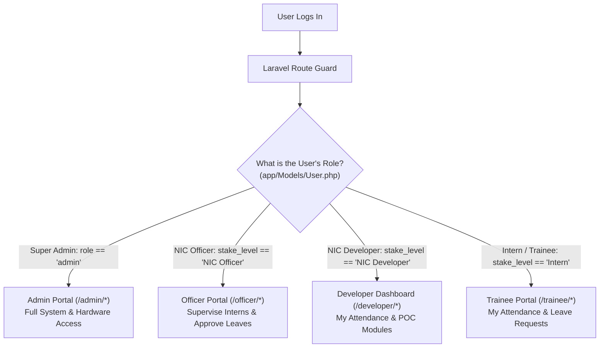

#### Connected Files for Q1:
| File Path | Everyday Name | Role in User Isolation |
| :--- | :--- | :--- |
| [`app/Http/Middleware/IsAdmin.php`](file:///d:/aiLab/app/Http/Middleware/IsAdmin.php) | **Admin Bouncer** | Checks if `$user->role === 'admin'`. Blocks non-admins with 403 Forbidden. |
| [`app/Http/Middleware/IsOfficer.php`](file:///d:/aiLab/app/Http/Middleware/IsOfficer.php) | **Officer Bouncer** | Checks if `$user->stakeLevel->name === 'NIC Officer'`. Blocks unauthorized users from `/officer/*`. |
| [`app/Http/Middleware/IsUser.php`](file:///d:/aiLab/app/Http/Middleware/IsUser.php) | **Standard User Bouncer** | Directs standard registered users to their respective home dashboard. |
| [`app/Models/User.php`](file:///d:/aiLab/app/Models/User.php) | **User Model** | Contains relationships `stakeLevel()` and helper methods `isAdmin()`, `isOfficer()`, `hasFrbasAccess()`. |
| [`app/Models/StakeLevel.php`](file:///d:/aiLab/app/Models/StakeLevel.php) | **Role Taxonomy** | Stores master role names (`NIC Officer`, `NIC Developer`, `Intern / Trainee`). |
| [`routes/web.php`](file:///d:/aiLab/routes/web.php) | **Route Firewall** | Wraps URLs in security groups: `Route::middleware('isAdmin')` and `Route::middleware('isOfficer')`. |

#### Exact Technical Code Logic:
In [`app/Http/Middleware/IsOfficer.php`](file:///d:/aiLab/app/Http/Middleware/IsOfficer.php):
```php
public function handle(Request $request, Closure $next): Response
{
    if (!auth()->check()) {
        return redirect()->route('login.show');
    }
    $user = auth()->user();
    // Superadmins can access officer views; otherwise user must hold 'NIC Officer' stake level
    if ($user->isAdmin()) {
        return $next($request);
    }
    $stakeLevel = $user->stakeLevel()->first();
    if (!$stakeLevel || $stakeLevel->name !== 'NIC Officer') {
        abort(403, 'Unauthorized. NIC Officer privileges required.');
    }
    return $next($request);
}
```

---

### Q2: How does FRBAS 1:N Identification work and how are false positives avoided?
**Answer (Zero Technical Background Needed)**:
Imagine a room with 100 students. Instead of asking each person for their ID card (1:1), a camera looks at a face and tries to spot who it is out of all 100 students (1:N).
* **Turning Faces into Math**: The camera takes a snapshot and turns the face into a list of 512 numbers (called a facial vector). These numbers describe the exact geometry of eye spacing, cheekbones, and nose bridge.
* **The 65% Match Rule**: The computer compares these numbers against all registered students. If the closest match is less than 65% similar, it rejects the person (*"Face not recognized"*).
* **The Twin / Lookalike Guard (0.08 Margin)**: What if two people look almost identical (e.g. 82% match and 80% match)? Instead of guessing and risking giving the wrong person attendance, the system detects that the gap is smaller than 8% (0.08) and flags it as **Ambiguous**. It rejects both to guarantee 100% attendance accuracy.

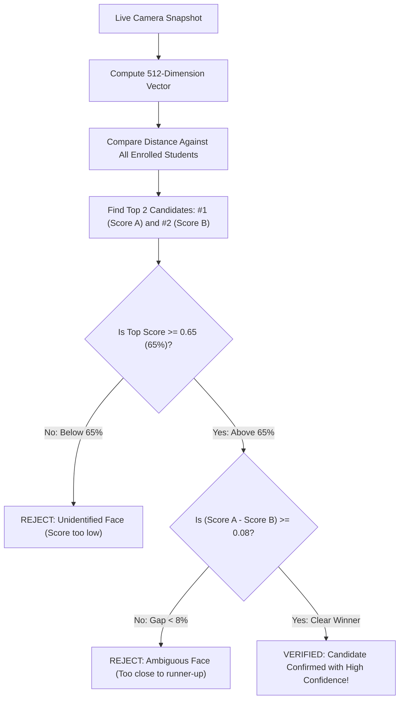

#### Connected Files for Q2:
| File Path | Everyday Name | Role in 1:N Identification |
| :--- | :--- | :--- |
| [`app/Services/BiometricApiService.php`](file:///d:/aiLab/app/Services/BiometricApiService.php) | **Biometric Engine** | Calculates vector distance, evaluates similarity percentage, and enforces the 0.08 ambiguity margin. |
| [`app/Http/Controllers/Attendance1NController.php`](file:///d:/aiLab/app/Http/Controllers/Attendance1NController.php) | **1:N Controller** | Coordinates camera frame submission, checks verification status, and logs punches. |
| [`app/Models/AttendanceStudent.php`](file:///d:/aiLab/app/Models/AttendanceStudent.php) | **Student Record** | Stores the stored baseline `embedding` vector in PostgreSQL. |
| [`resources/views/frbas/public-identify-1n.blade.php`](file:///d:/aiLab/resources/views/frbas/public-identify-1n.blade.php) | **Kiosk View** | Sends video frames and displays match or ambiguity alerts. |

#### Exact Technical Code Logic:
In [`app/Services/BiometricApiService.php`](file:///d:/aiLab/app/Services/BiometricApiService.php):
```php
// Step 1: Compare distance between live vector and candidate vector
$distance = $this->calculateEuclideanDistance($queryVector, $candidateVector);
$similarity = 1.0 - ($distance / 2.0); // Convert distance into 0.0 - 1.0 similarity score

// Step 2: Strict threshold check (0.65 / 65%)
if ($topScore < 0.65) {
    return ['status' => 'unidentified', 'failure_reason' => 'Face not matching.'];
}

// Step 3: Confidence margin guard against lookalikes
if (count($rankedCandidates) > 1) {
    $gap = $rankedCandidates[0]['similarity'] - $rankedCandidates[1]['similarity'];
    if ($gap < 0.08) {
        return ['status' => 'ambiguous', 'failure_reason' => 'Multiple candidates matched with similar confidence.'];
    }
}
```

---

### Q3: What is Debounce Suppression and how is it implemented?
**Answer (Zero Technical Background Needed)**:
Imagine a turnstile at a metro station. If you tap your card and then stand in the doorway for 20 seconds adjusting your backpack, the turnstile shouldn't charge your card 10 times in a row!
* **The Problem**: A gate camera scans every 2 or 3 seconds. If someone stands in front of the door talking to a friend, the camera would otherwise record dozens of duplicate check-ins.
* **The Solution**: Once a verified punch is recorded for a person, a **60-second cooldown timer** starts. If the camera recognizes the same person walking in the same direction within those 60 seconds, it acknowledges them, logs a harmless note (`rate_limited`), and refuses to create duplicate punches in the database.

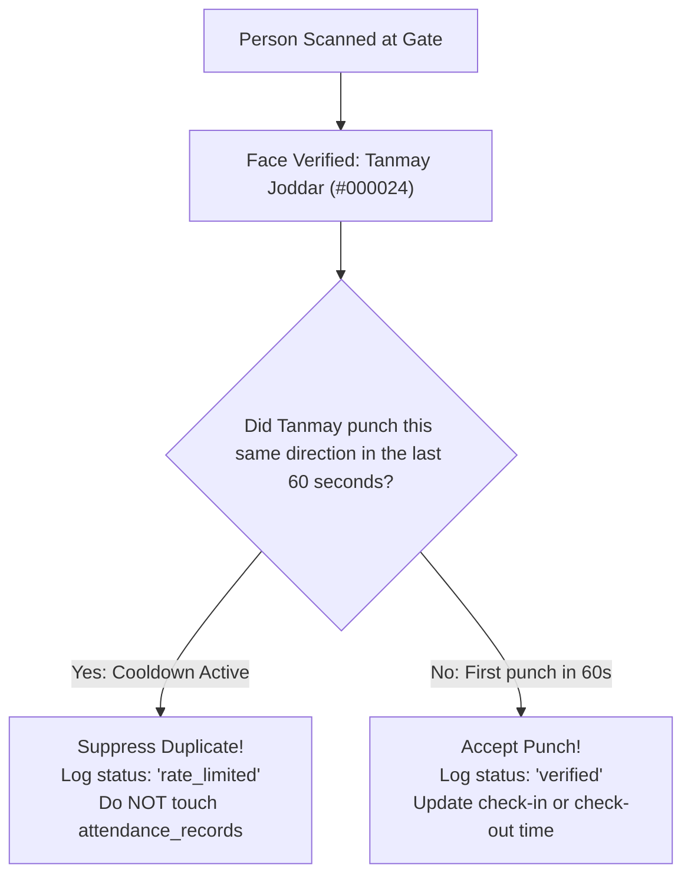

#### Connected Files for Q3:
| File Path | Everyday Name | Role in Debounce Suppression |
| :--- | :--- | :--- |
| [`app/Services/AttendanceCalculationService.php`](file:///d:/aiLab/app/Services/AttendanceCalculationService.php) | **Calculation Engine** | Implements `isDebounced()` checking recent verified events within 60 seconds. |
| [`app/Models/AttendanceEvent.php`](file:///d:/aiLab/app/Models/AttendanceEvent.php) | **Punch Ledger** | Stores recent punch timestamps queried during the cooldown check. |
| [`app/Http/Controllers/Attendance1NController.php`](file:///d:/aiLab/app/Http/Controllers/Attendance1NController.php) | **Kiosk Brain** | Calls `isDebounced()` before creating daily records. |
| [`app/Http/Controllers/GateTerminalController.php`](file:///d:/aiLab/app/Http/Controllers/GateTerminalController.php) | **Gate Terminal Brain**| Enforces 60-second debounce on turnstile cameras. |

#### Exact Technical Code Logic:
In [`app/Services/AttendanceCalculationService.php`](file:///d:/aiLab/app/Services/AttendanceCalculationService.php):
```php
public function isDebounced(int $studentId, string $direction, ?int $deviceId, int $cooldownSeconds = 60): bool
{
    $cutoff = Carbon::now('Asia/Kolkata')->subSeconds($cooldownSeconds);

    return AttendanceEvent::where('attendance_student_id', $studentId)
        ->where('direction', $direction)
        ->where('status', 'verified')
        ->where('captured_at', '>=', $cutoff)
        ->exists();
}
```

---

### Q4: How is trainee-supervisor linkage guaranteed without throwing "No Supervising Officer Assigned" errors?
**Answer (Zero Technical Background Needed)**:
Every intern needs a supervising officer (mentor) to review their work and sign off on their leave requests. 
If an intern was registered without choosing a supervisor, or if their supervisor transferred out, older systems would crash with ugly errors like *"Error: Undefined property $underOfficer"*.
Our system uses an **Auto-Healing Resolver**:
1. First, it looks at the intern's registration profile for an assigned officer.
2. If none exists, it checks who approved their last leave request.
3. If still none exists, it automatically pairs them with the primary active NIC Officer in the lab.
The intern's profile is self-healed, and leave forms always work smoothly without errors!

#### Connected Files for Q4:
| File Path | Everyday Name | Role in Linkage Resolution |
| :--- | :--- | :--- |
| [`app/Http/Controllers/TraineeAttendanceController.php`](file:///d:/aiLab/app/Http/Controllers/TraineeAttendanceController.php) | **Trainee Controller** | Loads supervisor details for intern self-service dashboard. |
| [`app/Http/Controllers/HomeController.php`](file:///d:/aiLab/app/Http/Controllers/HomeController.php) | **Dashboard Controller** | Runs auto-healing logic when rendering trainee home view. |
| [`app/Models/FrbasRegistration.php`](file:///d:/aiLab/app/Models/FrbasRegistration.php) | **Registration Record** | Stores `under_officer_id` foreign key. |
| [`app/Models/Leave.php`](file:///d:/aiLab/app/Models/Leave.php) | **Leave Application** | Records `reviewed_by_officer_id` used as fallback history. |
| [`app/Models/User.php`](file:///d:/aiLab/app/Models/User.php) | **User Account** | Queries active officers matching the `NIC Officer` stake level. |

#### Exact Technical Code Logic:
In [`app/Http/Controllers/TraineeAttendanceController.php`](file:///d:/aiLab/app/Http/Controllers/TraineeAttendanceController.php):
```php
$supervisingOfficer = $myFrbas?->underOfficer;

// Auto-Healing Fallback 1: Check prior approved leave officer
if (!$supervisingOfficer) {
    $lastReviewedOfficerId = Leave::where('user_id', $user->id)
        ->whereNotNull('reviewed_by_officer_id')
        ->latest('updated_at')
        ->value('reviewed_by_officer_id');
    if ($lastReviewedOfficerId) {
        $supervisingOfficer = User::find($lastReviewedOfficerId);
    }
}

// Auto-Healing Fallback 2: Default to primary active lab officer
if (!$supervisingOfficer) {
    $supervisingOfficer = User::whereHas('stakeLevel', fn($q) => $q->where('name', 'NIC Officer'))->first();
    if ($myFrbas && $supervisingOfficer) {
        $myFrbas->updateQuietly(['under_officer_id' => $supervisingOfficer->id]);
    }
}
```

---

### Q5: How does leave approval automatically update the attendance ledger?
**Answer (Zero Technical Background Needed)**:
In traditional offices, an employee applies for leave, an officer signs it, and then someone has to remember to manually open the attendance sheet and mark them as "On Leave" so they don't get marked "Absent".
In our system, the moment an NIC Officer clicks **"Approve Leave"**:
1. The leave status changes to **Approved**.
2. The computer automatically finds the attendance register for that date and marks it as **Leave Approved**.
3. When the monthly report is generated, the date shows up with a blue **Leave** badge instead of a red **Absent** mark!

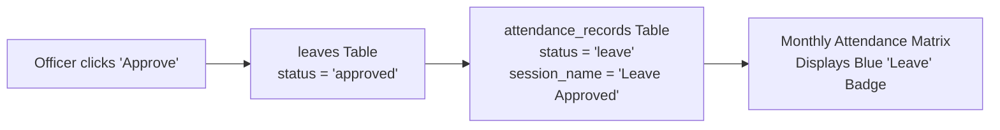

#### Connected Files for Q5:
| File Path | Everyday Name | Role in Leave Synchronization |
| :--- | :--- | :--- |
| [`app/Http/Controllers/OfficerLeaveController.php`](file:///d:/aiLab/app/Http/Controllers/OfficerLeaveController.php) | **Officer Leave Inbox** | Receives approval POST and synchronizes attendance table. |
| [`app/Models/Leave.php`](file:///d:/aiLab/app/Models/Leave.php) | **Leave Record** | Stores leave dates, reason, and approval timestamp. |
| [`app/Models/AttendanceRecord.php`](file:///d:/aiLab/app/Models/AttendanceRecord.php) | **Attendance Sheet** | Upserted with `status: 'leave'` and approver name. |
| [`resources/views/officer/leave-inbox.blade.php`](file:///d:/aiLab/resources/views/officer/leave-inbox.blade.php) | **Inbox View** | Modal and action buttons for approving or rejecting leave requests. |

#### Exact Technical Code Logic:
In [`app/Http/Controllers/OfficerLeaveController.php`](file:///d:/aiLab/app/Http/Controllers/OfficerLeaveController.php):
```php
public function approve(int $id): RedirectResponse
{
    $leave = Leave::findOrFail($id);
    $leave->update([
        'status' => 'approved',
        'reviewed_by_officer_id' => auth()->id(),
        'reviewed_at' => Carbon::now('Asia/Kolkata'),
    ]);

    // Synchronize daily attendance record
    $student = AttendanceStudent::where('user_id', $leave->user_id)->first();
    if ($student) {
        AttendanceRecord::updateOrCreate(
            [
                'attendance_student_id' => $student->id,
                'created_at' => Carbon::parse($leave->attendance_date)->startOfDay(),
            ],
            [
                'session_name' => 'Leave Approved by ' . auth()->user()->name,
                'status'       => 'leave',
            ]
        );
    }
    return back()->with('success', 'Leave approved and attendance register updated.');
}
```

---

### Q6: How does the audit logging mechanism track modifications to biometric registrations?
**Answer (Zero Technical Background Needed)**:
Think of an airplane's black box. If an admin or officer edits an intern's name, changes their phone number, or takes a new face picture, we must have an unchangeable record of who touched what.
* Whenever anyone clicks **"Save Changes & Log Audit"**, the system creates a permanent row in `frbas_audit_logs`.
* It records: who made the edit, their email and role, the person being edited, the exact old values, the new values, whether the face photo was changed, their IP address, and the exact timestamp.
* Nobody &mdash; not even an administrator &mdash; can edit or delete this audit log.

#### Connected Files for Q6:
| File Path | Everyday Name | Role in Audit Trail |
| :--- | :--- | :--- |
| [`app/Http/Controllers/AttendanceController.php`](file:///d:/aiLab/app/Http/Controllers/AttendanceController.php) | **Registration Engine** | Captures before-and-after snapshots and writes to `frbas_audit_logs`. |
| [`app/Models/FrbasAuditLog.php`](file:///d:/aiLab/app/Models/FrbasAuditLog.php) | **Audit Log Model** | Eloquent model with casts for `old_values` and `new_values` JSON arrays. |
| [`app/Http/Controllers/FrbasController.php`](file:///d:/aiLab/app/Http/Controllers/FrbasController.php) | **Audit Inspector** | `getAuditLogs()` endpoint returning chronological audit history. |
| [`resources/views/frbas/registration.blade.php`](file:///d:/aiLab/resources/views/frbas/registration.blade.php) | **FRBAS Step 1 View** | "Save Changes & Log Audit" button and modal trigger. |

#### Exact Technical Code Logic:
In [`app/Http/Controllers/AttendanceController.php`](file:///d:/aiLab/app/Http/Controllers/AttendanceController.php#L350-L370):
```php
FrbasAuditLog::create([
    'frbas_registration_id' => $existingFrbas->id,
    'user_id'               => $linkedUser?->id,
    'target_name'           => $existingFrbas->name,
    'target_type'           => $existingFrbas->type,
    'action'                => $photoUpdated ? 'updated_record_and_photo' : 'updated_details',
    'edited_by_user_id'     => $user->id,
    'editor_name'           => $user->name,
    'editor_email'          => $user->email,
    'editor_role'           => $user->isAdmin() ? 'Super Admin' : 'NIC Officer',
    'ip_address'            => $request->ip(),
    'user_agent'            => $request->userAgent(),
    'old_values'            => $oldValues,
    'new_values'            => $newValues,
    'photo_updated'         => $photoUpdated,
]);
```

---

### Q7: How are hardware edge devices authenticated and prevented from spoofing direction?
**Answer (Zero Technical Background Needed)**:
Imagine someone installs a physical smart camera at the exit turnstile. If a hacker or malicious script sends requests claiming that the exit camera is actually the entrance camera, attendance would get flipped backwards.
* **The Hardware Key**: Every physical camera has a unique 64-character secret password (`api_key`) generated by the Super Admin.
* **The Server Dictates Direction**: When the camera sends a photo, it is NOT allowed to tell the server *"I am an entrance"*. The server looks up the camera's key in the database: if the database says this camera is mounted at `Gate OUT`, the punch is **guaranteed** to be an exit punch. The hardware device cannot forge its direction.

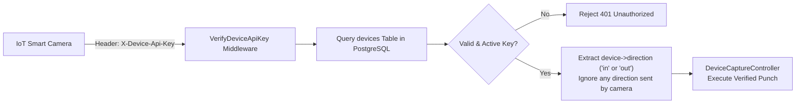

#### Connected Files for Q7:
| File Path | Everyday Name | Role in Hardware Security |
| :--- | :--- | :--- |
| [`app/Http/Middleware/VerifyDeviceApiKey.php`](file:///d:/aiLab/app/Http/Middleware/VerifyDeviceApiKey.php) | **Hardware Guard** | Validates `X-Device-Api-Key` against database table `devices`. |
| [`app/Http/Controllers/DeviceCaptureController.php`](file:///d:/aiLab/app/Http/Controllers/DeviceCaptureController.php) | **IoT Controller** | Receives binary image from IoT cameras and logs punch with server-enforced direction. |
| [`app/Models/Device.php`](file:///d:/aiLab/app/Models/Device.php) | **Device Model** | Stores camera name, location, 64-character `api_key`, and locked `direction`. |
| [`routes/api.php`](file:///d:/aiLab/routes/api.php) | **API Routes** | Protects `/api/device/attendance/capture` with `verifyDeviceApiKey`. |

#### Exact Technical Code Logic:
In [`app/Http/Middleware/VerifyDeviceApiKey.php`](file:///d:/aiLab/app/Http/Middleware/VerifyDeviceApiKey.php):
```php
public function handle(Request $request, Closure $next): Response
{
    $apiKey = $request->header('X-Device-Api-Key') ?? $request->bearerToken();
    if (empty($apiKey)) {
        return response()->json(['success' => false, 'message' => 'Missing Device API Key.'], 401);
    }
    $device = Device::where('api_key', $apiKey)->where('is_active', true)->first();
    if (!$device) {
        return response()->json(['success' => false, 'message' => 'Invalid or deactivated device.'], 401);
    }
    // Lock direction to database configuration
    $request->attributes->set('authenticated_device', $device);
    return $next($request);
}
```

---

### Q8: How does the 1:N Identification microservice pipeline work, and how are candidate privacy & threshold security enforced?
**Answer (Zero Technical Background Needed)**:
When a live face snapshot is sent to the server:
1. **Face Count**: Checks that exactly one face is in the photo. If two people are standing in the frame, it stops to avoid confusion.
2. **Anti-Spoofing (Liveness)**: Ensures someone isn't holding up a photograph or playing a video on an iPad.
3. **Similarity Threshold (65%)**: If the match confidence is 64%, it is immediately rejected.
4. **Candidate Privacy**: If a scan fails or matches someone weakly, the system NEVER reveals who it almost matched with. It wipes all candidate names from the response and simply says: *"Face not matching. Please try again or register your face."* This prevents unauthorized people from learning who is in the database.

#### Connected Files for Q8:
| File Path | Everyday Name | Role in AI Pipeline & Privacy |
| :--- | :--- | :--- |
| [`app/Services/BiometricApiService.php`](file:///d:/aiLab/app/Services/BiometricApiService.php) | **Biometric Service** | Calls anti-spoofing, vector identification, and sanitizes failure responses. |
| [`config/services.php`](file:///d:/aiLab/config/services.php) | **Service Config** | Defines `services.frbas.similarity_threshold` (default 0.65). |
| [`app/Http/Controllers/Attendance1NController.php`](file:///d:/aiLab/app/Http/Controllers/Attendance1NController.php) | **1:N Controller** | Sanitizes error payloads before sending to browser. |

#### Exact Technical Code Logic:
In [`app/Services/BiometricApiService.php`](file:///d:/aiLab/app/Services/BiometricApiService.php):
```php
$threshold = (float) config('services.frbas.similarity_threshold', 0.65);

if ($topCandidate['similarity'] < $threshold) {
    Log::info('1:N Identification rejected: top similarity below threshold', [
        'score' => $topCandidate['similarity'],
        'threshold' => $threshold,
    ]);
    return [
        'status'         => 'unidentified',
        'student'        => null,
        'similarity'     => $topCandidate['similarity'],
        'candidates'     => [], // Privacy sanitized: candidate identities stripped!
        'failure_reason' => 'Face not matching. Please try again or register your face.',
    ];
}
```

---

### Q9: How does hands-free Auto-Direction (First = IN, Subsequent = OUT) and duration calculation operate in 1:N mode?
**Answer (Zero Technical Background Needed)**:
On an all-in-one kiosk (where a single camera is used for both entering and leaving):
* You don't need to push any buttons or flip any switches.
* When you walk up in the morning, the system checks today's attendance sheet. Since you haven't checked in yet, it automatically marks **Check-In (IN)**.
* When you walk up later in the afternoon to leave, it sees you already checked in this morning, so it automatically marks **Check-Out (OUT)** and tells you your total working hours (e.g. *8 hrs 10 mins*)!

#### Connected Files for Q9:
| File Path | Everyday Name | Role in Auto-Direction |
| :--- | :--- | :--- |
| [`app/Http/Controllers/Attendance1NController.php`](file:///d:/aiLab/app/Http/Controllers/Attendance1NController.php) | **1:N Controller** | Resolves auto-direction based on existing check-in records. |
| [`app/Services/AttendanceCalculationService.php`](file:///d:/aiLab/app/Services/AttendanceCalculationService.php) | **Duration Engine** | Calculates total daily active time across all punch pairs. |
| [`app/Models/AttendanceRecord.php`](file:///d:/aiLab/app/Models/AttendanceRecord.php) | **Daily Record** | Stores official `check_in_at` and `check_out_at`. |

#### Exact Technical Code Logic:
In [`app/Http/Controllers/Attendance1NController.php`](file:///d:/aiLab/app/Http/Controllers/Attendance1NController.php#L140-L175):
```php
$today = $now->format('Y-m-d');
$existing = AttendanceRecord::where('attendance_student_id', $student->id)
    ->whereDate('created_at', $today)
    ->first();

// Auto-Direction: If already checked in today, this punch is OUT; otherwise IN
$direction = ($existing && $existing->check_in_at) ? 'out' : 'in';

if (!$existing) {
    $existing = AttendanceRecord::create([
        'attendance_student_id' => $student->id,
        'session_name'          => '1:N Terminal',
        'similarity'            => $result['similarity'],
        'check_in_at'           => $now,
    ]);
} else {
    if ($direction === 'out') {
        $existing->update([
            'check_out_at' => $now,
            'similarity'   => $result['similarity'],
        ]);
    }
}
$dailySummary = $this->calcService->calculateDailySummary($student->id, $today);
```

---

### Q10: How does profile editing synchronize embeddings to the 1:N microservice without touching photo uploads?
**Answer (Zero Technical Background Needed)**:
Suppose an admin opens an intern's profile to correct a typo in their name or update their phone number. They don't need to retake the intern's face photo!
* The intern's mathematical facial vector (512 numbers) is already safely stored in PostgreSQL.
* When the admin clicks **"Save Changes & Log Audit"**, the system re-dispatches their existing vector to the external facial recognition engine.
* The AI engine updates its student registry index immediately, ensuring 1:N identification stays up to date without wasting time capturing photos again.

#### Connected Files for Q10:
| File Path | Everyday Name | Role in Vector Sync |
| :--- | :--- | :--- |
| [`app/Http/Controllers/AttendanceController.php`](file:///d:/aiLab/app/Http/Controllers/AttendanceController.php) | **Registration Engine** | Detects when photo is kept and re-dispatches existing embedding. |
| [`app/Services/BiometricApiService.php`](file:///d:/aiLab/app/Services/BiometricApiService.php) | **Biometric API Bridge** | Posts `job_id` and `face_emb` to external microservice. |
| [`app/Models/AttendanceStudent.php`](file:///d:/aiLab/app/Models/AttendanceStudent.php) | **Student Record** | Stores baseline `embedding` string in database. |

#### Exact Technical Code Logic:
In [`app/Http/Controllers/AttendanceController.php`](file:///d:/aiLab/app/Http/Controllers/AttendanceController.php#L480-L525):
```php
// If keeping existing photo, reuse stored mathematical embedding
if (!$newPhotoUploaded && $existingStudent && $existingStudent->embedding) {
    $embedding = $existingStudent->embedding;
}

// Re-register embedding in external 1:N recognition index
try {
    $regUrl = config('services.frbas.face_registration_url');
    Http::withHeaders(['Content-Type' => 'application/json'])
        ->timeout(60)
        ->post($regUrl, [
            'job_id'   => (string) $student->id,
            'face_emb' => (string) $embedding,
        ]);
} catch (\Exception $e) {
    Log::warning('1:N external face registration sync failed', ['error' => $e->getMessage()]);
}
```

---

### Q11: In simple, everyday terms, what are Gate IN and Gate OUT terminals, and what happens step-by-step when someone walks up to the door?
**Answer (Zero Technical Background Needed)**:
Imagine a smart automatic doorway where nobody has to carry an ID card, punch in a PIN code, or touch any screen:
* **Gate IN** (`/gate/in`): Installed on the entrance turnstile. When you arrive, you walk past this camera to check in.
* **Gate OUT** (`/gate/out`): Installed on the exit turnstile. When you leave for lunch or go home, you walk past this camera to check out.

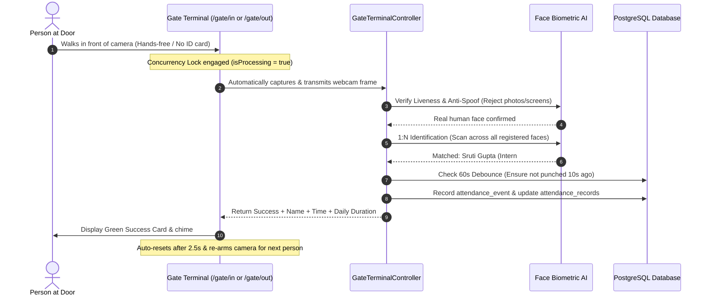

#### Connected Files for Q11:
| File Path | Everyday Name | Role in Gate Flow |
| :--- | :--- | :--- |
| [`resources/views/gate/terminal.blade.php`](file:///d:/aiLab/resources/views/gate/terminal.blade.php) | **Turnstile Kiosk View** | Fullscreen camera interface with green reticle, auto-scan, and audio chime. |
| [`app/Http/Controllers/GateTerminalController.php`](file:///d:/aiLab/app/Http/Controllers/GateTerminalController.php) | **Gate Controller** | Processes snapshots, coordinates AI checks, and manages debounce. |
| [`app/Services/BiometricApiService.php`](file:///d:/aiLab/app/Services/BiometricApiService.php) | **Biometric Service** | AI anti-spoofing and 1:N face identification. |
| [`app/Models/AttendanceEvent.php`](file:///d:/aiLab/app/Models/AttendanceEvent.php) | **Audit Event** | Writes permanent log row for entry/exit punch. |
| [`app/Models/AttendanceRecord.php`](file:///d:/aiLab/app/Models/AttendanceRecord.php) | **Daily Summary** | Updates official check-in and check-out times. |

---

### Q12: How does the system know whether a person is "Checking In" or "Checking Out"?
**Answer (Zero Technical Background Needed)**:
The system determines Check-In vs. Check-Out depending on which terminal is being used:
1. **Physical Turnstiles (Gate IN vs Gate OUT)**:
   * The camera at the entrance door is hardwired to **IN** mode (`/gate/in`). Any face recognized here is logged as an entrance.
   * The camera at the exit door is hardwired to **OUT** mode (`/gate/out`). Any face recognized here is logged as an exit.
2. **Autonomous Kiosks (Auto-Direction)**:
   * On public kiosks (`/attendance/1n`), there is only one camera. The system checks: *Is this the first time seeing you today?* If yes, it logs **Check-In**. If you already checked in earlier today, it logs **Check-Out**.

#### Connected Files for Q12:
| File Path | Everyday Name | Role in Direction Logic |
| :--- | :--- | :--- |
| [`app/Http/Controllers/GateTerminalController.php`](file:///d:/aiLab/app/Http/Controllers/GateTerminalController.php) | **Gate Terminal Brain** | Enforces direction parameter locked to route (`showIn` vs `showOut`). |
| [`app/Http/Controllers/Attendance1NController.php`](file:///d:/aiLab/app/Http/Controllers/Attendance1NController.php) | **1:N Kiosk Brain** | Implements the auto-direction algorithm comparing against today's records. |
| [`routes/web.php`](file:///d:/aiLab/routes/web.php) | **Routing Table** | Dedicated endpoints `/gate/in` and `/gate/out`. |

---

### Q13: Since the gate camera is continuously scanning every 2 seconds, why doesn't it crash, hang, or record someone 10 times in a row?
**Answer (Zero Technical Background Needed)**:
Two powerful security shields protect the system:
1. **The Browser Concurrency Lock (`isProcessing`)**: When the camera takes a snapshot and sends it to the server, it locks itself (`isProcessing = true`). Even though the camera checks every 2 seconds, it refuses to send any new photos until the previous photo finishes processing. This prevents browser memory leaks and freezes.
2. **The Server-Side Debounce Timer (60s)**: If you stand in front of the camera chatting with someone, the server notices you were already verified less than 60 seconds ago. It smoothly skips creating duplicate punches.

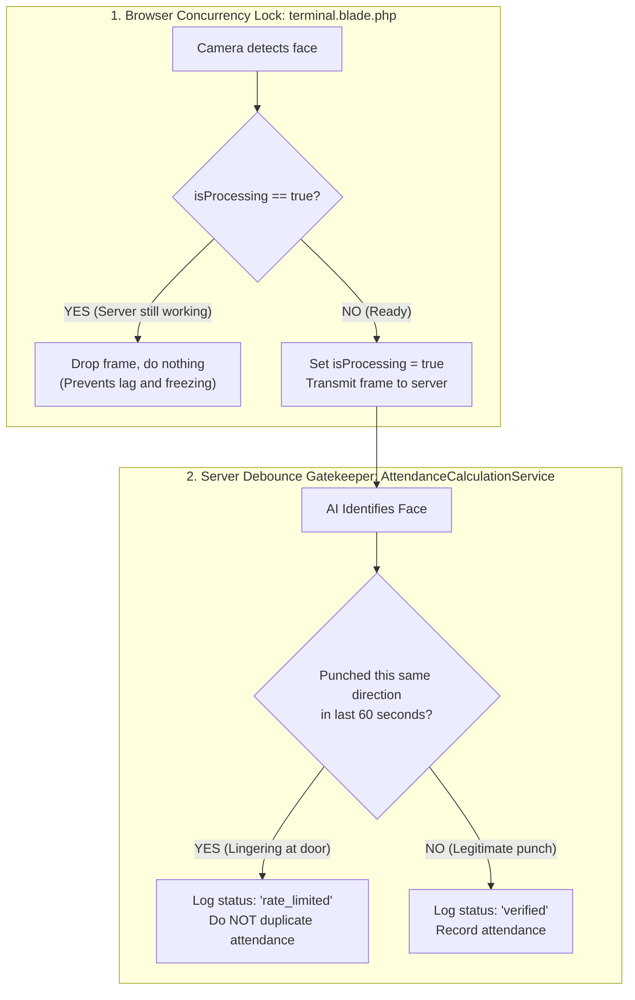

#### Connected Files for Q13:
| File Path | Everyday Name | Role in System Stability |
| :--- | :--- | :--- |
| [`resources/views/gate/terminal.blade.php`](file:///d:/aiLab/resources/views/gate/terminal.blade.php) | **Gate View** | Contains client-side `isProcessing` lock preventing concurrent AJAX calls. |
| [`app/Services/AttendanceCalculationService.php`](file:///d:/aiLab/app/Services/AttendanceCalculationService.php) | **Calculation Service** | Queries PostgreSQL for existing punches within the 60-second cooldown window. |
| [`app/Http/Controllers/GateTerminalController.php`](file:///d:/aiLab/app/Http/Controllers/GateTerminalController.php) | **Gate Controller** | Handles `rate_limited` status without crashing. |

#### Exact Technical Code Logic:
In [`resources/views/gate/terminal.blade.php`](file:///d:/aiLab/resources/views/gate/terminal.blade.php):
```javascript
let isProcessing = false;

async function triggerScan() {
    if (isProcessing) return; // Shield 1: Discard frame if previous scan is still processing
    isProcessing = true;

    try {
        const response = await fetch('/gate/capture', { /* ... */ });
        const data = await response.json();
        // ... show result ...
    } finally {
        isProcessing = false; // Release lock when complete
    }
}
```

---

### Q14: What are "Connected Devices" in this system, and how do physical smart cameras or Raspberry Pis work with Gate IN and Gate OUT?
**Answer (Zero Technical Background Needed)**:
A "Connected Device" is any physical piece of hardware installed in the building:
* A wall-mounted tablet running Google Chrome in fullscreen kiosk mode.
* An industrial Hikvision or Dahua smart camera connected to the local network.
* A Raspberry Pi microcomputer wired to an electronic turnstile door-latch.
Each device is registered in the Super Admin portal, gets a unique name (e.g., `GATE-IN-WEST-TURNSTILE`), and receives a cryptographic API key.

#### Connected Files for Q14:
| File Path | Everyday Name | Role in Hardware Integration |
| :--- | :--- | :--- |
| [`app/Models/Device.php`](file:///d:/aiLab/app/Models/Device.php) | **Device Record** | Stores device code, name, location, 64-char API key, and active toggle. |
| [`app/Http/Controllers/Admin/AdminDeviceController.php`](file:///d:/aiLab/app/Http/Controllers/Admin/AdminDeviceController.php) | **Device Manager** | Allows Super Admin to create, toggle, regenerate keys, or delete devices. |
| [`app/Http/Controllers/DeviceCaptureController.php`](file:///d:/aiLab/app/Http/Controllers/DeviceCaptureController.php) | **Hardware Ingest** | Receives binary camera streams from IoT devices. |
| [`database/migrations/2026_06_03_000001_create_devices_table.php`](file:///d:/aiLab/database/migrations/2026_06_03_000001_create_devices_table.php) | **Database Schema** | Schema definition for the `devices` table. |

---

### Q15: How does a Super Admin set up, configure, and monitor a new Gate Device in the Admin Portal?
**Answer (Zero Technical Background Needed)**:
Setting up a new camera takes less than 30 seconds:
1. Super Admin logs into `/admin/devices`.
2. Clicks **"Register New Device"** and enters:
   * **Device Code**: e.g., `GATE-IN-MAIN-ENTRANCE`
   * **Location**: e.g., `Ground Floor Turnstile 1`
   * **Direction**: `IN` or `OUT`
3. The system automatically creates a unique 64-character API Key (`api_key`).
4. The Admin clicks **"Copy Terminal URL"** and pastes it into the tablet browser, or pastes the API key into an IoT camera.
5. If a camera is ever stolen or broken, the Admin can toggle it **Off** or click **Regenerate Key** with one click.

#### Connected Files for Q15:
| File Path | Everyday Name | Role in Device Administration |
| :--- | :--- | :--- |
| [`resources/views/admin/devices/index.blade.php`](file:///d:/aiLab/resources/views/admin/devices/index.blade.php) | **Device Portal View** | Admin screen listing registered hardware, status toggles, and audit feed. |
| [`app/Http/Controllers/Admin/AdminDeviceController.php`](file:///d:/aiLab/app/Http/Controllers/Admin/AdminDeviceController.php) | **Device Controller** | Generates 64-char cryptographic random token (`Str::random(64)`). |
| [`app/Models/Device.php`](file:///d:/aiLab/app/Models/Device.php) | **Device Model** | Handles database persistence. |

---

### Q16: When personnel check in and out multiple times a day (e.g. lunch breaks), where is this stored and how do mentors and superadmins see their total hours?
**Answer (Zero Technical Background Needed)**:
People leave for lunch, attend meetings across the road, and return. The system tracks this accurately using two distinct database tables:
1. **The Raw Punch Ledger (`attendance_events`)**: Keeps an unerasable row for every scan:
   * 09:15 AM: Punch IN (Arrival)
   * 01:10 PM: Punch OUT (Lunch) &rarr; *Shift 1: 3 hrs 55 mins*
   * 02:00 PM: Punch IN (Return)
   * 06:15 PM: Punch OUT (Home) &rarr; *Shift 2: 4 hrs 15 mins*
2. **The Consolidated Sheet (`attendance_records`)**: Holds today's summary.
The calculation engine automatically matches each IN with its OUT and adds them up:
$$3\text{h } 55\text{m} + 4\text{h } 15\text{m} = \mathbf{8\text{ hours } 10\text{ minutes}}!$$

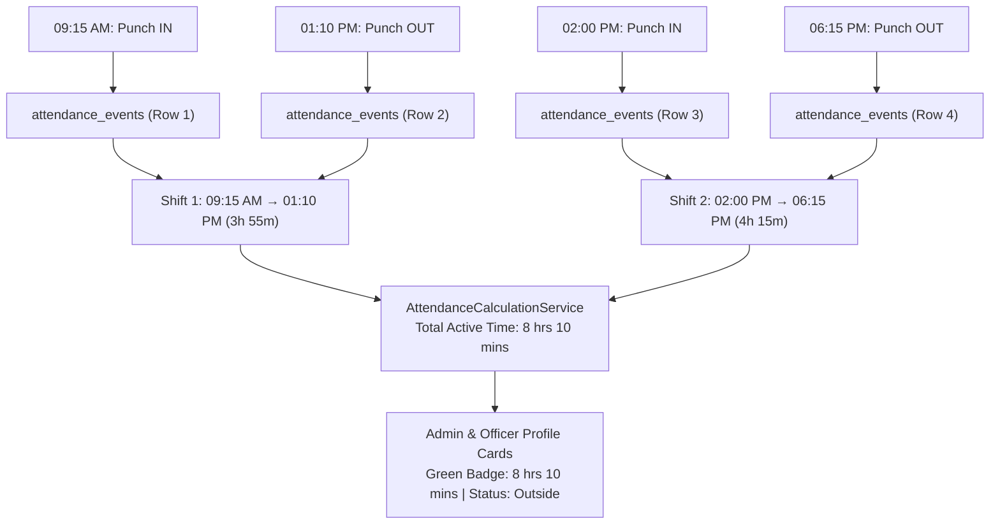

#### Connected Files for Q16:
| File Path | Everyday Name | Role in Multi-Punch Tracking |
| :--- | :--- | :--- |
| [`app/Services/AttendanceCalculationService.php`](file:///d:/aiLab/app/Services/AttendanceCalculationService.php) | **Calculation Engine** | `calculateDailySummary()` pairs chronological IN/OUT events and sums intervals. |
| [`app/Models/AttendanceEvent.php`](file:///d:/aiLab/app/Models/AttendanceEvent.php) | **Raw Punch Table** | Stores every single entry/exit event. |
| [`app/Models/AttendanceRecord.php`](file:///d:/aiLab/app/Models/AttendanceRecord.php) | **Consolidated Table** | Holds daily high-level check-in and check-out. |
| [`resources/views/admin/interns/show.blade.php`](file:///d:/aiLab/resources/views/admin/interns/show.blade.php) | **Admin Intern Profile** | Displays total daily hours badge and punch interval chips. |
| [`resources/views/officer/interns/show.blade.php`](file:///d:/aiLab/resources/views/officer/interns/show.blade.php) | **Officer Intern Profile** | Displays total daily hours badge and punch interval chips. |

---

### Q17: Why did the Face ID change to a 6-digit number like `000025`, and how does it work across every portal and screen?
**Answer (Zero Technical Background Needed)**:
Originally, IDs were simple counting numbers (`7` or `25`). But on physical badges and punch logs, single digits look inconsistent and are easy to mistype.
Now, the entire facility standardizes on a **6-digit zero-padded Face ID format** (e.g. `000025` for ID 25, `000007` for ID 7).

#### Connected Files for Q17:
| File Path | Everyday Name | Role in 6-Digit ID Standardization |
| :--- | :--- | :--- |
| [`app/Models/AttendanceStudent.php`](file:///d:/aiLab/app/Models/AttendanceStudent.php) | **Student Model** | Accessors `formatted_id` and `formatted_roll_id` return `str_pad(id, 6, '0')`. |
| [`app/Models/User.php`](file:///d:/aiLab/app/Models/User.php) | **User Model** | Accessor `face_id` returns 6-digit zero-padded string. |
| [`app/Http/Controllers/AttendanceController.php`](file:///d:/aiLab/app/Http/Controllers/AttendanceController.php) | **Attendance Engine** | Saves 6-digit `roll_id` during enrollment and rejects short numbers `< 6` digits. |
| [`resources/views/admin/interns/index.blade.php`](file:///d:/aiLab/resources/views/admin/interns/index.blade.php) | **Admin Directory** | Displays 6-digit Face ID column (`000025`). |
| [`resources/views/officer/interns/index.blade.php`](file:///d:/aiLab/resources/views/officer/interns/index.blade.php) | **Officer Directory** | Displays 6-digit Face ID column (`000025`). |
| [`resources/views/admin/users/registered.blade.php`](file:///d:/aiLab/resources/views/admin/users/registered.blade.php) | **User Management** | Displays `#000025` in user table and view modal. |

#### Exact Technical Code Logic:
In [`app/Models/AttendanceStudent.php`](file:///d:/aiLab/app/Models/AttendanceStudent.php):
```php
public function getFormattedIdAttribute(): string
{
    return str_pad((string) $this->id, 6, '0', STR_PAD_LEFT);
}

public function getFormattedRollIdAttribute(): string
{
    if (!empty($this->roll_id) && strlen($this->roll_id) === 6) {
        return $this->roll_id;
    }
    return $this->getFormattedIdAttribute();
}
```

---

### Q18: How does the new 1:N Kiosk link on the login page work, and how can guests use it without logging in?
**Answer (Zero Technical Background Needed)**:
Previously, giving attendance without entering an ID (1:N recognition) was only available after logging in. But at a real office entrance, arriving personnel do not log into an admin dashboard on personal accounts.
Now, directly on the login screen (`/login`), a dedicated **`1:N Kiosk`** button is available alongside `1:1 Kiosk`, `Gate IN`, and `Gate OUT`.
* **No Navbar**: It opens a standalone, full-screen kiosk interface with zero website menus (`Home`, `About`, `Project & POCs` are hidden).
* **Complete Guest Access**: Operates without authentication sessions. Anyone can walk up and give attendance immediately.
* **Integrated Switcher**: Buttons at the bottom let users jump between 1:1 Kiosk, Gate IN, Gate OUT, or Back to Login.

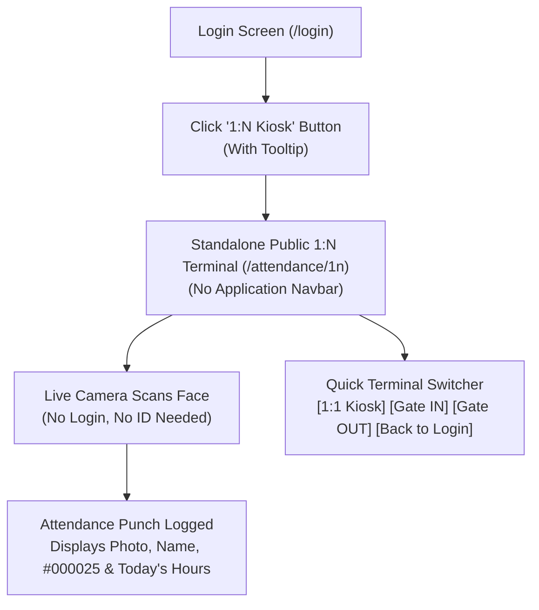

#### Connected Files for Q18:
| File Path | Everyday Name | Role in Public Kiosk Experience |
| :--- | :--- | :--- |
| [`resources/views/admin/login.blade.php`](file:///d:/aiLab/resources/views/admin/login.blade.php) | **Login Screen** | Hosts the `1:N Kiosk` badge with hover tooltip. |
| [`resources/views/frbas/public-identify-1n.blade.php`](file:///d:/aiLab/resources/views/frbas/public-identify-1n.blade.php) | **Standalone 1:N Kiosk** | Pure kiosk card UI with dark gradient and zero application navbar. |
| [`resources/views/frbas/public-mark-attendance.blade.php`](file:///d:/aiLab/resources/views/frbas/public-mark-attendance.blade.php) | **Standalone 1:1 Kiosk** | 1:1 manual roll ID kiosk with terminal switcher footer. |
| [`app/Http/Controllers/Attendance1NController.php`](file:///d:/aiLab/app/Http/Controllers/Attendance1NController.php) | **Kiosk Controller** | `publicIndex()` serves standalone view; `identify()` processes verification. |
| [`routes/web.php`](file:///d:/aiLab/routes/web.php) | **Routing Table** | Public route `Route::get('/attendance/1n')` with zero auth middleware. |

---

### Q19: How is 1:N Face Identification specifically restricted to Interns/Students only, and what is the exact code logic?
**Answer (Zero Technical Background Needed & Complete Code Breakdown)**:
In 1:1 attendance, a student first types their ID (like `000025`), so the computer already knows whom they claim to be. But in **1:N Unattended Scanning**, nobody types anything &mdash; someone simply stands in front of a camera!

In our lab facility, **NIC Officers**, **Senior Developers**, and **Interns** all walk past the same camera. However, Government Officers and Developers do not record attendance at student kiosks. Therefore, the system must **automatically detect whether the face belongs to an Intern or a Staff member**, even though nobody typed an ID.

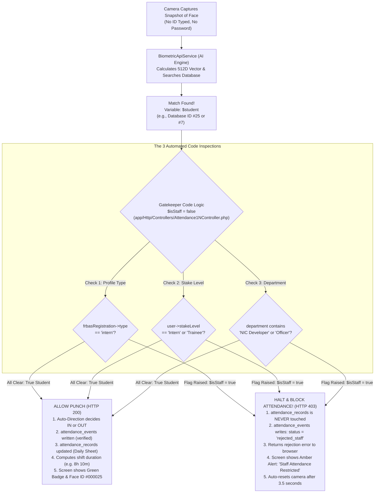

#### Connected Files for Q19:
| File Path | Everyday Name | What This File Does |
| :--- | :--- | :--- |
| [`app/Http/Controllers/Attendance1NController.php`](file:///d:/aiLab/app/Http/Controllers/Attendance1NController.php) | **The 1:N Brain** | Receives camera photo, calls AI matching, runs the 3 Intern checks, and decides whether to allow or block punch. |
| [`app/Http/Controllers/GateTerminalController.php`](file:///d:/aiLab/app/Http/Controllers/GateTerminalController.php) | **Turnstile Gate Brain** | Same verification logic for physical mounted Turnstiles (`Gate IN` / `Gate OUT`). |
| [`app/Http/Controllers/AttendanceController.php`](file:///d:/aiLab/app/Http/Controllers/AttendanceController.php) | **The 1:1 Brain** | Handles single-student verification and enforces strict 6-digit Face ID format (rejects `25` or `7`). |
| [`app/Services/BiometricApiService.php`](file:///d:/aiLab/app/Services/BiometricApiService.php) | **The AI Engine Bridge** | Sends face snapshots to deep-learning AI container and retrieves candidate match scores. |
| [`resources/views/frbas/public-identify-1n.blade.php`](file:///d:/aiLab/resources/views/frbas/public-identify-1n.blade.php) | **The Kiosk Screen** | Standalone public terminal (no website navbar) with webcam viewport, auto-scan, and alert cards. |
| [`app/Models/AttendanceStudent.php`](file:///d:/aiLab/app/Models/AttendanceStudent.php) | **Student Model** | Database model storing student name, 6-digit `roll_id` (`000025`), department, and facial vector. |
| [`app/Models/FrbasRegistration.php`](file:///d:/aiLab/app/Models/FrbasRegistration.php) | **Enrollment Record** | Stores registration type (`intern`, `nic_developer`, `nic_officer`) assigned during Step 1. |
| [`app/Models/AttendanceEvent.php`](file:///d:/aiLab/app/Models/AttendanceEvent.php) | **The Punch Ledger** | Permanent security log storing every scan (both verified punches and blocked staff attempts). |
| [`app/Models/AttendanceRecord.php`](file:///d:/aiLab/app/Models/AttendanceRecord.php) | **Daily Attendance Sheet** | Holds today's official check-in/out times for interns (never touched for staff). |
| [`routes/web.php`](file:///d:/aiLab/routes/web.php) | **The Traffic Police** | Maps public URL `/attendance/1n` to kiosk view and protects internal `/frbas/identify-1n` behind security guards. |

#### Exact Technical Code Logic:
In [`app/Http/Controllers/Attendance1NController.php`](file:///d:/aiLab/app/Http/Controllers/Attendance1NController.php#L99-L139):
```php
// Step 1: The AI engine finds the person in the database and stores their profile in $student
$student = $result['student'];

// Step 2: We create a safety warning flag variable called $isStaff.
// It starts as FALSE (assuming the person is an intern until proven otherwise).
$isStaff = false;

// CHECK 1: Look at the person's registration record from Step 1
if ($student->frbasRegistration && $student->frbasRegistration->type !== 'intern') {
    $isStaff = true;
}
// CHECK 2: Look at their user login account and system job title (stake level)
elseif ($student->user && $student->user->stake_level_id !== null) {
    $stakeName = $student->user->stakeLevel?->name;
    if ($stakeName && !in_array(strtolower($stakeName), ['intern', 'trainee'])) {
        $isStaff = true;
    }
}
// CHECK 3: Backup safety check — look at the department name column
elseif (in_array(strtolower(trim((string) $student->department)), ['nic developer', 'nic officer', 'admin', 'officer', 'developer'])) {
    $isStaff = true;
}

if ($isStaff) {
    // 1. Write an entry into the security audit ledger
    AttendanceEvent::create([
        'attendance_student_id' => $student->id,
        'device_id'             => null,
        'match_type'            => '1:N',
        'direction'             => $request->input('direction', 'auto') === 'out' ? 'out' : 'in',
        'status'                => 'rejected_staff',
        'similarity_score'      => $result['similarity'],
        'candidate_matches'     => $result['candidates'] ?? null,
        'failure_reason'        => 'Attendance terminal is reserved for Students (Interns/Trainees) only. Officer and Developer attendance is not recorded.',
        'captured_at'           => $now,
    ]);

    // 2. Return an immediate HTTP 403 Forbidden error response
    return response()->json([
        'success' => false,
        'status'  => 'rejected_staff',
        'message' => 'Attendance terminal is reserved for Students (Interns/Trainees) only. Officer and Developer attendance is not recorded.',
        'match'   => [
            'id'         => $student->id,
            'roll_id'    => $student->formatted_roll_id,
            'name'       => $student->name,
            'department' => $student->department,
        ],
    ], 403);
}
```

#### Strict 6-Digit ID Code Logic (Blocking `25` or `7`):
In [`app/Http/Controllers/AttendanceController.php`](file:///d:/aiLab/app/Http/Controllers/AttendanceController.php#L693-L706):
```php
$rollId = trim($request->string('roll_id')->toString());

// If someone types pure digits with fewer than 6 characters (like "25" or "7")
if (ctype_digit($rollId) && strlen($rollId) < 6) {
    return response()->json([
        'success' => false,
        'message' => 'Invalid Face ID format. Please enter your full 6-digit Face ID (e.g. ' . str_pad($rollId, 6, '0', STR_PAD_LEFT) . ') or 10-digit mobile number.',
    ], 422);
}

// Only search for the exact 6-digit string
$student = AttendanceStudent::where('roll_id', $rollId)->first();
```

---
*Generated directly from comprehensive codebase inspection of `nilavobiswas/ailabkolkata`.*
