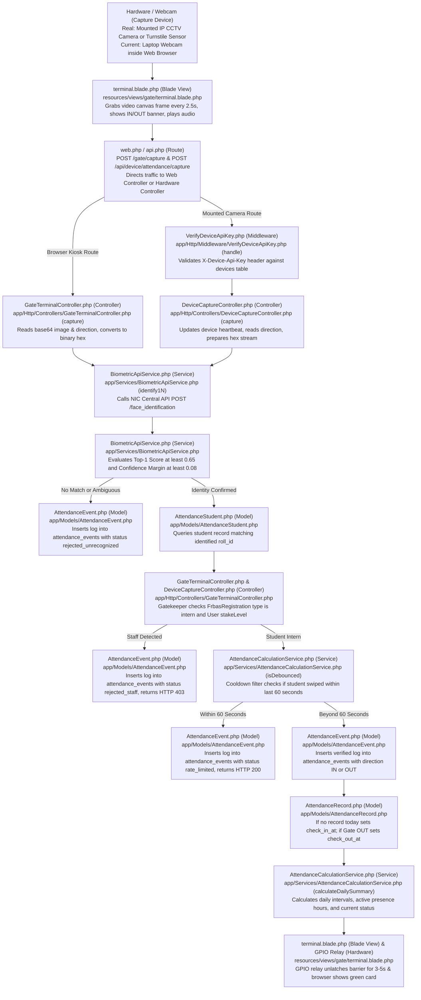
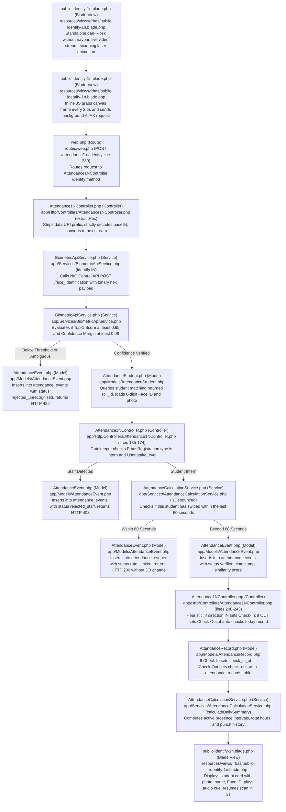
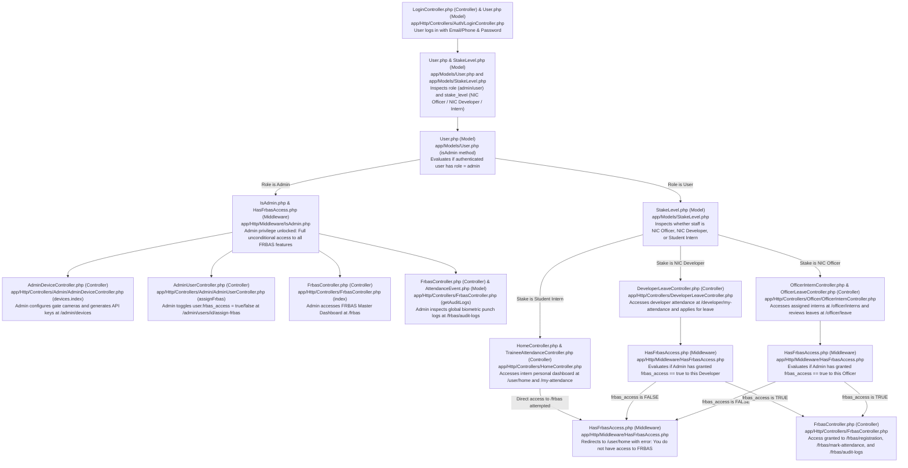

# EXACT CODEBASE DATA FLOW & FILE RESPONSIBILITY GUIDE
### Facial Recognition Biometric Attendance System (FRBAS) & Gate Turnstiles
#### Centre of Excellence in Artificial Intelligence (COE-AI), National Informatics Centre (NIC), Kolkata

---

> **FORMAT STANDARD FOR ALL DIAGRAMS BELOW**:  
> Every single box in every flowchart starts with the exact **File Name** with its classification **right beside the file name** (e.g. `GateTerminalController.php (Controller)` or `terminal.blade.php (Blade View)`).  
> All boxes strictly use rectangular nodes `["..."]` to guarantee zero text clipping under modern Mermaid versions.

---

## 1. Flow 1: Gate IN / Gate OUT & Mounted Hardware Cameras

### How it Works in a Real Physical System vs Current Setup:
- **Current Laptop Setup**: You open `http://127.0.0.1:8000/gate/in` or `/gate/out` in a web browser. The laptop webcam takes photos via HTML5 JavaScript every 2.5 seconds and submits them to `GateTerminalController.php`.
- **Real Physical System**:
  1. A physical IP CCTV camera or turnstile camera is mounted at eye level at the entrance/exit gate.
  2. The hardware controller (Raspberry Pi, industrial IPC, or camera firmware) detects a person via optical proximity sensors and grabs the high-resolution face crop.
  3. The hardware sends an unprompted HTTP request directly to the API endpoint: `POST /api/device/attendance/capture` using a secret cryptographic API key (`X-Device-Api-Key`).
  4. The request is authenticated by `VerifyDeviceApiKey.php` (Middleware) and ingested by `DeviceCaptureController.php` (Controller).
  5. If the face is verified, the system returns HTTP 200, which triggers a hardware dry-contact relay or GPIO pin to physically unlatch the turnstile barrier for 3 to 5 seconds.

---

### Gate IN / Gate OUT & Mounted Camera: Data Flow Diagram

---

## 2. Flow 2: 1:1 Public Kiosk Attendance (`/attendance/public`)

### What this Mode is:
Manual student verification where a student walks up to an entrance tablet/terminal, types their **strict 6-digit Face ID** (e.g. `000025`) or **10-digit mobile number**, captures a single webcam photograph, and marks attendance.

---

### 1:1 Public Kiosk: Data Flow Diagram

```mermaid
flowchart TD
    K1["public-mark-attendance.blade.php (Blade View)<br>resources/views/frbas/public-mark-attendance.blade.php<br>Standalone kiosk without navbar, input for Face ID or mobile, camera capture"]
    K2["web.php (Route)<br>routes/web.php (POST /attendance/mark line 237)<br>Routes form submission with roll_id, session_name, image_base64"]
    K3["AttendanceController.php (Controller)<br>app/Http/Controllers/AttendanceController.php (mark)<br>Validates ID length at least 6 digits, rejects short inputs like 25 with HTTP 422"]
    K4["AttendanceStudent.php & User.php (Model)<br>app/Models/AttendanceStudent.php and app/Models/User.php<br>Resolves student record by 6-digit roll_id or 10-digit phone"]
    K4Check["AttendanceController.php (Controller)<br>app/Http/Controllers/AttendanceController.php<br>Verifies whether student record was found in database"]
    K4Err["public-mark-attendance.blade.php (Blade View)<br>resources/views/frbas/public-mark-attendance.blade.php<br>Returns HTTP 404: No registered face found, please register via Step 1"]
    K5["AttendanceController.php (Controller)<br>app/Http/Controllers/AttendanceController.php (lines 740-753)<br>Checks FrbasRegistration type is intern and User stake_level_id"]
    K5Err["public-mark-attendance.blade.php (Blade View)<br>resources/views/frbas/public-mark-attendance.blade.php<br>Returns HTTP 403: Kiosk is reserved for Students only, staff attendance not recorded"]
    K6["AttendanceController.php (Controller)<br>app/Http/Controllers/AttendanceController.php (extractImageHex)<br>Strips data URI header, decodes base64 strictly, converts to hex stream"]
    K7["AttendanceController.php (Controller) & NIC API (External Service)<br>POST https://ailabkol.nic.in/frbas_cpu/intern/face_count<br>ensureSingleFace requires exactly 1 human face, rejects 0 faces or crowd"]
    K8["AttendanceController.php (Controller) & NIC API (External Service)<br>POST https://ailabkol.nic.in/frbas_cpu/intern/face_antispoof<br>ensureLiveFace neural texture analysis rejects screens, printed photos, replays"]
    K9["AttendanceController.php (Controller) & NIC API (External Service)<br>POST https://ailabkol.nic.in/frbas_cpu/intern/face_encoding<br>Extracts live normalized 512-dimensional vector embedding"]
    K10["AttendanceController.php (Controller) & NIC API (External Service)<br>POST https://ailabkol.nic.in/frbas_cpu/intern/face_similarity<br>Compares stored student embedding vs live embedding"]
    K10Check["AttendanceController.php (Controller)<br>app/Http/Controllers/AttendanceController.php<br>Evaluates if Cosine Similarity is at least 0.65"]
    K10Err["public-mark-attendance.blade.php (Blade View)<br>resources/views/frbas/public-mark-attendance.blade.php<br>Returns HTTP 422: Face not matching, please try again"]
    K11["AttendanceRecord.php (Model)<br>app/Models/AttendanceRecord.php<br>Checks if attendance record already exists for student today"]
    K11A["AttendanceRecord.php (Model)<br>app/Models/AttendanceRecord.php<br>Inserts into attendance_records with check_in_at = now, check_out_at = null"]
    K11B["AttendanceRecord.php (Model)<br>app/Models/AttendanceRecord.php<br>Updates existing record with check_out_at = now and similarity score"]
    K12["public-mark-attendance.blade.php (Blade View)<br>resources/views/frbas/public-mark-attendance.blade.php<br>Displays Emerald Green confirmation banner with similarity percentage"]

    K1 --> K2
    K2 --> K3
    K3 --> K4
    K4 --> K4Check
    K4Check -->|No Record Found| K4Err
    K4Check -->|Student Found| K5
    K5 -->|Staff Detected| K5Err
    K5 -->|Student Intern| K6
    K6 --> K7
    K7 --> K8
    K8 --> K9
    K9 --> K10
    K10 --> K10Check
    K10Check -->|Score below 0.65| K10Err
    K10Check -->|Score at least 0.65| K11
    K11 -->|No Record Today| K11A
    K11 -->|Record Exists Today| K11B
    K11A --> K12
    K11B --> K12
```

---

## 3. Flow 3: 1:N Unattended Biometric Identification Kiosk (`/attendance/1n`)

### What this Mode is:
Hands-free automated facial identification where students stand before the kiosk lens. The camera continuously evaluates frames every 2.5 seconds and identifies the student automatically without physical touch.

---

### 1:N Unattended Kiosk: Data Flow Diagram

---

## 4. Flow 4: FRBAS Multi-Role Access Control (Admin vs Developer vs Officer vs Intern)

### How Each Role Accesses FRBAS Differently:
1. **Super Admin**:
   - Holds universal administrative bypass (`role = 'admin'`).
   - Automatically satisfies `hasFrbasAccess` (Middleware) without needing manual privilege assignment.
   - Accesses `/frbas` (Dashboard, Face Registration, 1:1 Attendance, 1:N Kiosks, Audit Logs).
   - Manages physical turnstile devices at `/admin/devices` (`AdminDeviceController.php` (Controller)).
   - Assigns or revokes FRBAS access for Officers and Developers via `POST /admin/users/{id}/assign-frbas` (`AdminUserController.php` (Controller)).
2. **NIC Officer**:
   - Default role (`stakeLevel = 'NIC Officer'`) gives access to `/officer/interns` (`OfficerInternController.php` (Controller)) and `/officer/leave` (`OfficerLeaveController.php` (Controller)).
   - Does **NOT** have FRBAS access by default. If an Officer attempts to navigate to `/frbas`, `HasFrbasAccess.php` (Middleware) redirects them to `/user/home` with an unauthorized error.
   - When Super Admin grants `frbas_access = true`, the Officer can access `/frbas/audit-logs`, `/frbas/registration`, and attendance management.
3. **NIC Developer**:
   - Default role (`stakeLevel = 'NIC Developer'`) gives access to `/developer/my-attendance` and `/developer/leave/apply` (`DeveloperLeaveController.php` (Controller)).
   - Does **NOT** have FRBAS access by default.
   - When Super Admin grants `frbas_access = true`, the Developer can access the FRBAS portal to register biometric faces or monitor identification logs.
4. **Student Intern**:
   - Strictly forbidden from administrative FRBAS routes (`/frbas/*`).
   - Can only interact through public biometric terminal kiosks (`/attendance/public`, `/attendance/1n`, `/gate/in`, `/gate/out`) or their personal `/user/home` and `/my-attendance` portals.

---

### FRBAS Role Access & Privilege Granting Data Flow

---

## 5. Flow 5: Intern Portal Complete Architecture & Life-Cycle Flow

### What this Portal Covers:
1. **Authentication & Session**: Intern logs in with Email/Phone, passes dynamic SVG Captcha (`CaptchaController.php` (Controller)), and completes forced password reset if required (`PasswordChangeController.php` (Controller)).
2. **Dashboard & Overview (`/user/home`)**:
   - Handled by `HomeController.php` (Controller) -> `userHome()`.
   - Links the authenticated user to their `AttendanceStudent.php` (Model) and `FrbasRegistration.php` (Model).
   - Identifies their supervising officer (`under_officer_id`) and assigned Work / Qualification Domains.
   - Generates a full Google Calendar Grid (Sunday to Saturday) mapping each day to: Present, Absent, Weekend, Leave Approved, Leave Pending, or Leave Rejected.
   - Computes monthly metrics (Present count, Absent count, Approved leaves, Total working days).
   - Displays assigned AI Models and POCs for testing.
3. **Personal Attendance History (`/my-attendance`)**:
   - Handled by `TraineeAttendanceController.php` (Controller) -> `myAttendance()`.
   - Shows day-by-day check-in timestamps, total hours, and punch timelines.
4. **Leave Application Engine (`/leave/apply`)**:
   - Handled by `TraineeAttendanceController.php` (Controller) -> `applyLeave()`.
   - Intern submits leave date, reason, and supporting documents.
   - Inserts into `leaves` table with status `pending`, automatically routing it to their supervising officer's inbox (`/officer/leave`).

---

### Intern Portal: Complete Data Flow Diagram

```mermaid
flowchart TD
    I1["LoginController.php & CaptchaController.php (Controller)<br>app/Http/Controllers/Auth/LoginController.php<br>Validates captcha math string and user credentials on POST /login"]
    I2["ForcePasswordReset.php (Middleware)<br>app/Http/Middleware/ForcePasswordReset.php<br>Checks if intern has changed their initial default password"]
    I2_Reset["PasswordChangeController.php (Controller) & force-reset.blade.php (Blade View)<br>resources/views/auth/force-reset.blade.php<br>GET /password/force-reset: Intern updates password before proceeding"]
    I3["IsUser.php (Middleware) & User.php (Model)<br>app/Http/Middleware/IsUser.php<br>Ensures user is active and approved by administrator"]
    I4["HomeController.php (Controller)<br>app/Http/Controllers/HomeController.php (userHome)<br>GET /user/home: Main intern dashboard entrypoint"]
    I5["AttendanceStudent.php & FrbasRegistration.php (Model)<br>app/Models/AttendanceStudent.php<br>Matches user_id or phone to student profile and Face ID"]
    I6["User.php & Domain.php (Model)<br>app/Models/User.php (underOfficer relation)<br>Loads supervising NIC Officer name and Work / Qualification Domains"]
    I7["HomeController.php (Controller)<br>app/Http/Controllers/HomeController.php<br>Uses CarbonPeriod to generate Sun-Sat Google calendar cells for current month"]
    I8["AttendanceRecord.php & Leave.php (Model)<br>app/Models/AttendanceRecord.php and app/Models/Leave.php<br>Fetches verified punches and leave statuses for the month from database"]
    I9["HomeController.php (Controller)<br>app/Http/Controllers/HomeController.php<br>Calculates aggregate stats: present, absent, leave_approved, leave_pending, working_days"]
    I10["Category.php & AiModel.php (Model)<br>app/Models/Category.php and app/Models/AiModel.php<br>Loads assigned POC models the intern has permission to interact with"]
    I11["user/home.blade.php (Blade View)<br>resources/views/user/home.blade.php<br>Displays calendar grid, punch badges, assigned models, and officer card"]
    
    I12["TraineeAttendanceController.php (Controller) & my-attendance.blade.php (Blade View)<br>resources/views/trainee/my-attendance.blade.php<br>GET /my-attendance: Renders daily punch timestamps and attendance timeline"]
    
    I13["TraineeAttendanceController.php (Controller)<br>app/Http/Controllers/TraineeAttendanceController.php (applyLeave)<br>POST /leave/apply: Validates date range, reason, and supporting documents"]
    I14["Leave.php (Model)<br>app/Models/Leave.php<br>Inserts row into leaves table with status pending and under_officer_id"]
    I15["OfficerLeaveController.php (Controller) & leave-inbox.blade.php (Blade View)<br>resources/views/officer/leave-inbox.blade.php<br>GET /officer/leave: Supervising officer reviews and approves or rejects leave"]

    I1 --> I2
    I2 -->|First Login / Unreset| I2_Reset
    I2_Reset --> I1
    I2 -->|Password Changed| I3
    I3 --> I4
    I4 --> I5
    I5 --> I6
    I6 --> I7
    I7 --> I8
    I8 --> I9
    I9 --> I10
    I10 --> I11
    I11 -->|Clicks My Attendance| I12
    I11 -->|Applies for Leave| I13
    I12 -->|Applies for Leave| I13
    I13 --> I14
    I14 --> I15
```

---

**CENTRE OF EXCELLENCE IN ARTIFICIAL INTELLIGENCE (COE-AI)**  
National Informatics Centre (NIC), West Bengal State Centre, Kolkata  
Ministry of Electronics and Information Technology (MeitY), Government of India  
*Technical Architecture & Biometric Data Flow Manual*
