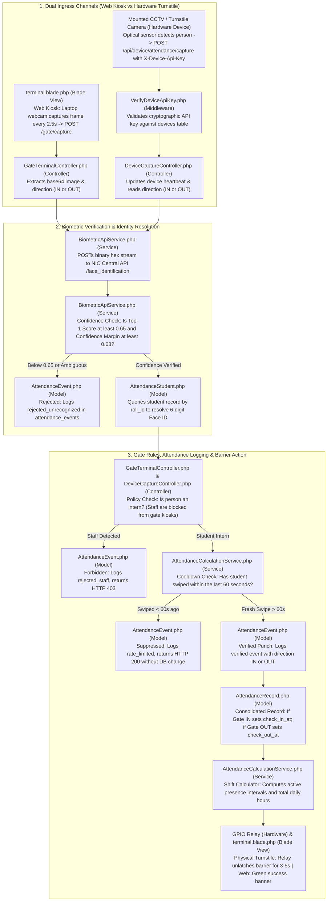
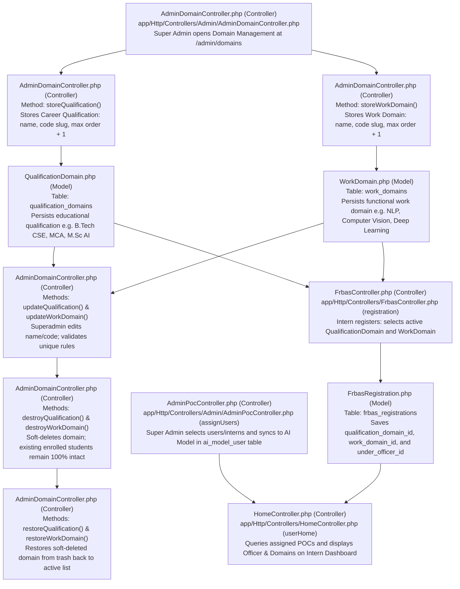
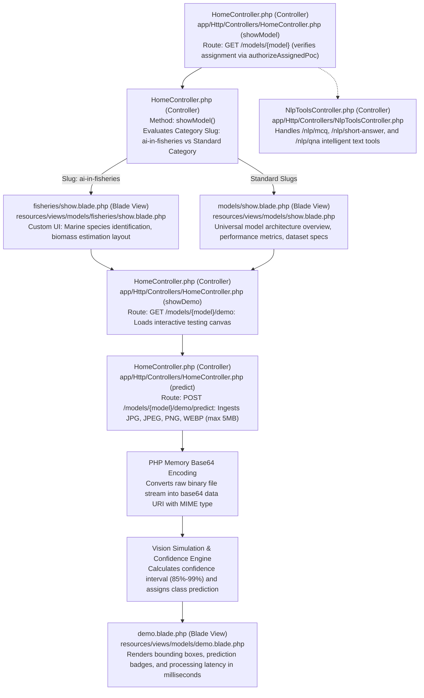
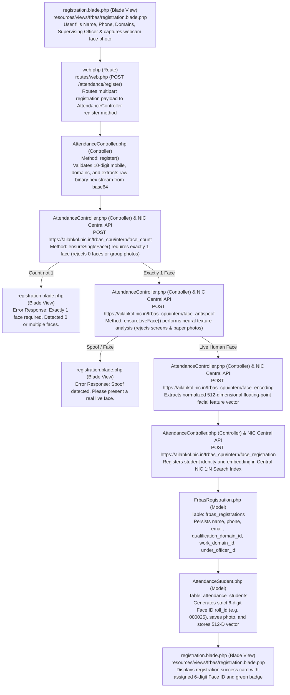

# EXACT CODEBASE DATA FLOW & FILE RESPONSIBILITY GUIDE
### Facial Recognition Biometric Attendance System (FRBAS) & Full Multi-Portal Architecture
#### Centre of Excellence in Artificial Intelligence (COE-AI), National Informatics Centre (NIC), Kolkata

---

## 1. Flow 1: Gate IN / Gate OUT & Mounted Hardware Cameras

### How it Works in a Real Physical System vs Current Setup:
- **Current Laptop Setup**: You open `http://127.0.0.1:8000/gate/in` or `/gate/out` in a web browser. The laptop webcam captures canvas frames via JavaScript every 2.5 seconds and submits them to `GateTerminalController.php`.
- **Real Physical System**:
  1. A physical IP CCTV camera or turnstile camera is mounted at eye level at the entrance/exit gate.
  2. The hardware controller (Raspberry Pi, industrial IPC, or camera firmware) detects a person via optical proximity sensors and grabs the high-resolution face crop.
  3. The hardware sends an unprompted HTTP request directly to the API endpoint: `POST /api/device/attendance/capture` using a secret cryptographic API key (`X-Device-Api-Key`).
  4. The request is authenticated by `VerifyDeviceApiKey.php` (Middleware) and ingested by `DeviceCaptureController.php` (Controller).
  5. If the face is verified, the system returns HTTP 200, which triggers a hardware dry-contact relay or GPIO pin to physically unlatch the turnstile barrier for 3 to 5 seconds.

### Quick File Responsibility Summary (Read this first):
- `terminal.blade.php` **(Blade View)**: Web interface for the gate. Grabs video frames every 2.5s, shows large IN/OUT banner, and displays green/red status cards.
- `GateTerminalController.php` **(Controller)**: Handles web camera requests from `POST /gate/capture`, reads direction (in/out), and converts images to binary hex.
- `VerifyDeviceApiKey.php` **(Middleware)**: Security guard for physical turnstile hardware; validates `X-Device-Api-Key` header against the `devices` database table.
- `DeviceCaptureController.php` **(Controller)**: Handles hardware camera requests from `POST /api/device/attendance/capture`, logs heartbeat, and forwards face hex stream.
- `BiometricApiService.php` **(Service)**: Calls NIC Central API (`/face_identification`) and checks if match score $\ge 0.65$ with confidence margin $\ge 0.08$.
- `AttendanceStudent.php` **(Model)**: Database lookup to fetch the identified student record and 6-digit Face ID.
- `AttendanceCalculationService.php` **(Service)**: Filters duplicate swipes within 60 seconds (anti-spam) and computes daily shift hours.
- `AttendanceEvent.php` **(Model)**: High-speed append-only audit log table recording every single gate attempt (`verified`, `rejected_unrecognized`, `rejected_staff`, `rate_limited`).
- `AttendanceRecord.php` **(Model)**: Daily consolidated record (`attendance_records`). Sets `check_in_at` on Gate IN and `check_out_at` on Gate OUT.

---

### Gate IN / Gate OUT & Mounted Camera: Simplified Data Flow Diagram

---
## 2. Flow 2: 1:1 Public Kiosk Attendance (`/attendance/public`)

### What this Mode is:
Manual student verification where a student walks up to an entrance tablet/terminal, types their **strict 6-digit Face ID** (e.g. `000025`) or **10-digit mobile number**, captures a single webcam photograph, and marks attendance.

---

### 1:1 Public Kiosk: Data Flow Diagram

```mermaid
flowchart TD
    K1["public-mark-attendance.blade.php (Blade View)<br>resources/views/frbas/public-mark-attendance.blade.php<br>Standalone kiosk without navbar, input for Face ID or mobile, camera capture"]
    K2["web.php (Route)<br>routes/web.php (POST /attendance/mark line 237)<br>Routes form submission with roll_id, session_name, image_base64"]
    K3["AttendanceController.php (Controller)<br>app/Http/Controllers/AttendanceController.php (mark)<br>Validates ID length at least 6 digits, rejects short inputs like 25 with HTTP 422"]
    K4["AttendanceStudent.php & User.php (Model)<br>app/Models/AttendanceStudent.php and app/Models/User.php<br>Resolves student record by 6-digit roll_id or 10-digit phone"]
    K4Check["AttendanceController.php (Controller)<br>app/Http/Controllers/AttendanceController.php<br>Verifies whether student record was found in database"]
    K4Err["public-mark-attendance.blade.php (Blade View)<br>resources/views/frbas/public-mark-attendance.blade.php<br>Returns HTTP 404: No registered face found, please register via Step 1"]
    K5["AttendanceController.php (Controller)<br>app/Http/Controllers/AttendanceController.php (lines 740-753)<br>Checks FrbasRegistration type is intern and User stake_level_id"]
    K5Err["public-mark-attendance.blade.php (Blade View)<br>resources/views/frbas/public-mark-attendance.blade.php<br>Returns HTTP 403: Kiosk is reserved for Students only, staff attendance not recorded"]
    K6["AttendanceController.php (Controller)<br>app/Http/Controllers/AttendanceController.php (extractImageHex)<br>Strips data URI header, decodes base64 strictly, converts to hex stream"]
    K7["AttendanceController.php (Controller) & NIC API (External Service)<br>POST https://ailabkol.nic.in/frbas_cpu/intern/face_count<br>ensureSingleFace requires exactly 1 human face, rejects 0 faces or crowd"]
    K8["AttendanceController.php (Controller) & NIC API (External Service)<br>POST https://ailabkol.nic.in/frbas_cpu/intern/face_antispoof<br>ensureLiveFace neural texture analysis rejects screens, printed photos, replays"]
    K9["AttendanceController.php (Controller) & NIC API (External Service)<br>POST https://ailabkol.nic.in/frbas_cpu/intern/face_encoding<br>Extracts live normalized 512-dimensional vector embedding"]
    K10["AttendanceController.php (Controller) & NIC API (External Service)<br>POST https://ailabkol.nic.in/frbas_cpu/intern/face_similarity<br>Compares stored student embedding vs live embedding"]
    K10Check["AttendanceController.php (Controller)<br>app/Http/Controllers/AttendanceController.php<br>Evaluates if Cosine Similarity is at least 0.65"]
    K10Err["public-mark-attendance.blade.php (Blade View)<br>resources/views/frbas/public-mark-attendance.blade.php<br>Returns HTTP 422: Face not matching, please try again"]
    K11["AttendanceRecord.php (Model)<br>app/Models/AttendanceRecord.php<br>Checks if attendance record already exists for student today"]
    K11A["AttendanceRecord.php (Model)<br>app/Models/AttendanceRecord.php<br>Inserts into attendance_records with check_in_at = now, check_out_at = null"]
    K11B["AttendanceRecord.php (Model)<br>app/Models/AttendanceRecord.php<br>Updates existing record with check_out_at = now and similarity score"]
    K12["public-mark-attendance.blade.php (Blade View)<br>resources/views/frbas/public-mark-attendance.blade.php<br>Displays Emerald Green confirmation banner with similarity percentage"]

    K1 --> K2
    K2 --> K3
    K3 --> K4
    K4 --> K4Check
    K4Check -->|No Record Found| K4Err
    K4Check -->|Student Found| K5
    K5 -->|Staff Detected| K5Err
    K5 -->|Student Intern| K6
    K6 --> K7
    K7 --> K8
    K8 --> K9
    K9 --> K10
    K10 --> K10Check
    K10Check -->|Score below 0.65| K10Err
    K10Check -->|Score at least 0.65| K11
    K11 -->|No Record Today| K11A
    K11 -->|Record Exists Today| K11B
    K11A --> K12
    K11B --> K12
```

---

## 3. Flow 3: 1:N Unattended Biometric Identification Kiosk (`/attendance/1n`)

### What this Mode is:
Hands-free automated facial identification where students stand before the kiosk lens. The camera continuously evaluates frames every 2.5 seconds and identifies the student automatically without physical touch.

### Quick File Responsibility Summary (Read this first):
- `public-identify-1n.blade.php` **(Blade View)**: Runs an auto-scanning webcam loop every 2.5s, displays live bounding boxes, plays audio chimes, and shows the student identification card.
- `routes/web.php` **(Route)**: Directs the background AJAX post (`POST /attendance/1n/identify`) to the 1:N controller.
- `Attendance1NController.php` **(Controller)**: Strips base64 headers, decodes the raw image into a hex stream, enforces student-only policy, determines IN vs OUT direction, and returns the JSON response.
- `BiometricApiService.php` **(Service)**: Sends the binary hex payload to the NIC Central Facial Recognition API (`/face_identification`) and checks if Top-1 score >= 0.65 with margin >= 0.08.
- `AttendanceStudent.php` **(Model)**: Database lookup model that resolves the student's name, photo, department, and 6-digit Face ID using the returned `roll_id`.
- `AttendanceEvent.php` **(Model)**: High-speed append-only audit log. Every single attempt is logged here (`verified`, `rejected_unrecognized`, `rejected_staff`, or `rate_limited`).
- `AttendanceCalculationService.php` **(Service)**: Enforces the 60-second duplicate debounce filter and calculates daily presence hours and shift intervals.
- `AttendanceRecord.php` **(Model)**: Daily consolidated attendance record. Stores today's official `check_in_at` and `check_out_at` timestamps for reports.

---

### 1:N Unattended Kiosk: Intuitive Step-by-Step Data Flow

```mermaid
flowchart TD
    %% FRONTEND CLIENT CAPTURE
    Step1["public-identify-1n.blade.php (Blade View)<br>1. Video Loop: Captures webcam frame every 2.5s and sends background AJAX POST"]
    
    %% ROUTING
    Step2["web.php (Route)<br>2. Endpoint: Routes POST /attendance/1n/identify to Controller"]
    
    %% INGESTION & HEX CONVERSION
    Step3["Attendance1NController.php (Controller)<br>3. Hex Prep: Strips data URI header and converts base64 image into raw binary hex stream"]
    
    %% BIOMETRIC AI CLOUD API
    Step4["BiometricApiService.php (Service)<br>4. Cloud Vision: POSTs binary hex to Central NIC API /face_identification"]
    
    %% CONFIDENCE GUARD
    Step5["BiometricApiService.php (Service)<br>5. Confidence Check: Is Top-1 Score at least 0.65 and Confidence Margin at least 0.08?"]
    
    %% REJECT: UNKNOWN
    Fail_Unknown["AttendanceEvent.php (Model)<br>5-A. Rejected: Logs unrecognized attempt in attendance_events, returns HTTP 422"]
    
    %% LOOKUP PROFILE
    Step6["AttendanceStudent.php (Model)<br>6. Profile Resolution: Queries student database by roll_id to load name, photo, and Face ID"]
    
    %% GATEKEEPER: INTERN ONLY
    Step7["Attendance1NController.php (Controller)<br>7. Policy Guard: Checks FrbasRegistration type is intern (rejects Officer/Developer staff)"]
    
    %% REJECT: STAFF
    Fail_Staff["AttendanceEvent.php (Model)<br>7-A. Forbidden: Logs rejected_staff attempt in attendance_events, returns HTTP 403"]
    
    %% 60-SECOND DEBOUNCE FILTER
    Step8["AttendanceCalculationService.php (Service)<br>8. Anti-Spam Debounce: Has this student swiped within the last 60 seconds?"]
    
    %% REJECT: DUPLICATE SWIPE
    Fail_Debounce["AttendanceEvent.php (Model)<br>8-A. Suppressed: Logs rate_limited in attendance_events, returns HTTP 200 without DB change"]
    
    %% LOG VERIFIED AUDIT PUNCH
    Step9["AttendanceEvent.php (Model)<br>9. Audit Log: Inserts verified punch event with exact timestamp and match similarity"]
    
    %% DIRECTION HEURISTIC (IN / OUT)
    Step10["Attendance1NController.php (Controller)<br>10. Direction Logic: Auto-determines IN (Check-In) vs OUT (Check-Out) based on today's logs"]
    
    %% SYNC DAILY CONSOLIDATED RECORD
    Step11["AttendanceRecord.php (Model)<br>11. Daily Attendance: Inserts check_in_at if first swipe today, or updates check_out_at if leaving"]
    
    %% RECALCULATE SHIFT HOURS
    Step12["AttendanceCalculationService.php (Service)<br>12. Metrics Engine: Recalculates total active presence hours and work intervals for today"]
    
    %% SUCCESS RESPONSE & UI UPDATE
    Step13["public-identify-1n.blade.php (Blade View)<br>13. Instant Feedback: Plays success chime, shows student card with photo, resumes scan in 3s"]

    %% CONNECTING THE STORY
    Step1 --> Step2
    Step2 --> Step3
    Step3 --> Step4
    Step4 --> Step5
    
    Step5 -->|No Match or Low Score| Fail_Unknown
    Step5 -->|Face Confirmed| Step6
    
    Step6 --> Step7
    Step7 -->|Staff Detected| Fail_Staff
    Step7 -->|Student Intern| Step8
    
    Step8 -->|Swiped within 60s| Fail_Debounce
    Step8 -->|Beyond 60s Cooldown| Step9
    
    Step9 --> Step10
    Step10 --> Step11
    Step11 --> Step12
    Step12 --> Step13
```

---
## 4. Flow 4: FRBAS Role Access & Privilege Granting Data Flow (All Portals Detailed)

```mermaid
flowchart TD
    %% INGRESS & AUTH
    Auth_Login["LoginController.php (Controller) & User.php (Model)<br>app/Http/Controllers/Auth/LoginController.php<br>User authenticates via email/phone, password, and CaptchaController.php"]
    Auth_Role["User.php & StakeLevel.php (Model)<br>app/Models/User.php and app/Models/StakeLevel.php<br>Loads role: admin vs user, and stake_level: NIC Officer / NIC Developer / Intern"]
    Check_Admin["User.php (Model)<br>app/Models/User.php (isAdmin method)<br>Branch condition: Is user role strictly superadmin?"]

    %% SUPER ADMIN SUITE
    SA_Mid["IsAdmin.php & HasFrbasAccess.php (Middleware)<br>app/Http/Middleware/IsAdmin.php<br>Unconditional bypass: grants complete access to all /admin and /frbas routes"]
    
    SA_Domains_Add["AdminDomainController.php (Controller)<br>Methods: storeQualification() & storeWorkDomain()<br>Superadmin creates Educational Qualifications and Work Domains with unique code & order"]
    
    SA_Domains_Edit["AdminDomainController.php (Controller)<br>Methods: updateQualification(), updateWorkDomain(), destroy(), restore()<br>Superadmin edits name/code, soft-deletes unused domains, or restores from trash"]
    
    SA_Users_Gov["AdminUserController.php (Controller)<br>Methods: approve(), reject(), update(), toggleActive()<br>Superadmin approves registrations, edits name/email, and activates or deactivates users"]
    
    SA_Users_FRBAS["AdminUserController.php (Controller)<br>Method: assignFrbas()<br>Superadmin toggles user.frbas_access flag: enables or revokes staff access to /frbas"]
    
    SA_POC_Create["AdminPocController.php & AdminCategoryController.php (Controller)<br>Methods: store(), update(), assignUsers()<br>Superadmin manages AI Categories & POCs, and syncs user access via pivot table"]
    
    SA_Interns_Gov["AdminInternController.php (Controller)<br>Methods: activeOverview(), exportAttendance(), show(), destroy()<br>Superadmin views live intern punches, exports CSV, and deletes intern records"]
    
    SA_Active_Dir["AdminActiveUserController.php (Controller)<br>Methods: developers(), officers(), interns()<br>Superadmin browses dedicated directory listings for active staff and students"]
    
    SA_Devices_Gov["AdminDeviceController.php (Controller)<br>Methods: store(), toggleStatus(), regenerateKey()<br>Superadmin registers turnstile cameras, toggles status, and generates X-Device-Api-Key"]
    
    SA_FRBAS_Master["FrbasController.php (Controller)<br>Methods: index(), registration(), markAttendance(), getAuditLogs()<br>Superadmin accesses master face registration, 1:1 test verification, and audit logs"]

    %% NON-ADMIN BRANCHES
    Check_Stake["StakeLevel.php (Model)<br>app/Models/StakeLevel.php<br>Branch condition: Evaluate specific staff or student stake level"]

    %% NIC OFFICER SUITE
    Off_Mid["IsOfficer.php (Middleware)<br>app/Http/Middleware/IsOfficer.php<br>Authorizes officer access to /officer/* management enclave"]
    
    Off_Interns["OfficerInternController.php (Controller)<br>Methods: index(), show(), exportAttendance()<br>Officer monitors assigned interns under_officer_id, views details, exports CSV"]
    
    Off_Leaves["OfficerLeaveController.php (Controller)<br>Methods: inbox(), approve(), reject()<br>Officer reviews pending leaves from assigned interns/developers, approves or rejects"]
    
    Off_FRBAS_Gate["HasFrbasAccess.php (Middleware)<br>app/Http/Middleware/HasFrbasAccess.php<br>Branch condition: Has Super Admin assigned frbas_access = true?"]

    %% NIC DEVELOPER SUITE
    Dev_Att["DeveloperLeaveController.php (Controller)<br>Method: myAttendance()<br>Developer views personal punch timestamps, monthly attendance stats and shifts"]
    
    Dev_Leave["DeveloperLeaveController.php (Controller)<br>Method: applyLeave()<br>Developer submits leave requests routed to assigned reviewing officer"]
    
    Dev_FRBAS_Gate["HasFrbasAccess.php (Middleware)<br>app/Http/Middleware/HasFrbasAccess.php<br>Branch condition: Has Super Admin assigned frbas_access = true?"]

    %% STUDENT INTERN SUITE
    Int_Home["HomeController.php (Controller)<br>Method: userHome()<br>Intern views monthly Google Calendar, assigned POCs, and supervising officer card"]
    
    Int_Leave["TraineeAttendanceController.php (Controller)<br>Methods: myAttendance(), applyLeave()<br>Intern tracks personal attendance history and applies for leave"]

    %% FRBAS GATEWAY RESULTS
    FRBAS_Allowed["FrbasController.php (Controller)<br>app/Http/Controllers/FrbasController.php<br>Access Granted: Register student faces, test 1:1 match, view biometric audit logs"]
    
    FRBAS_Denied["HasFrbasAccess.php (Middleware)<br>app/Http/Middleware/HasFrbasAccess.php<br>Access Denied: Redirects to /user/home with error You do not have access to FRBAS"]

    %% RELATIONSHIPS & FLOW
    Auth_Login --> Auth_Role
    Auth_Role --> Check_Admin
    Check_Admin -->|Role is Admin| SA_Mid
    
    SA_Mid --> SA_Domains_Add
    SA_Mid --> SA_Domains_Edit
    SA_Mid --> SA_Users_Gov
    SA_Mid --> SA_Users_FRBAS
    SA_Mid --> SA_POC_Create
    SA_Mid --> SA_Interns_Gov
    SA_Mid --> SA_Active_Dir
    SA_Mid --> SA_Devices_Gov
    SA_Mid --> SA_FRBAS_Master

    Check_Admin -->|Role is User| Check_Stake
    
    Check_Stake -->|Stake is NIC Officer| Off_Mid
    Off_Mid --> Off_Interns
    Off_Mid --> Off_Leaves
    Off_Mid --> Off_FRBAS_Gate
    Off_FRBAS_Gate -->|frbas_access is TRUE| FRBAS_Allowed
    Off_FRBAS_Gate -->|frbas_access is FALSE| FRBAS_Denied

    Check_Stake -->|Stake is NIC Developer| Dev_Att
    Dev_Att --> Dev_Leave
    Dev_Att --> Dev_FRBAS_Gate
    Dev_FRBAS_Gate -->|frbas_access is TRUE| FRBAS_Allowed
    Dev_FRBAS_Gate -->|frbas_access is FALSE| FRBAS_Denied

    Check_Stake -->|Stake is Student Intern| Int_Home
    Int_Home --> Int_Leave
    Int_Home -->|Direct access to /frbas attempted| FRBAS_Denied
```

---

## 5. Flow 5: Intern Portal Complete Architecture & Life-Cycle Flow

### What this Portal Covers:
1. **Authentication & Session**: Intern logs in with Email/Phone, passes dynamic SVG Captcha (`CaptchaController.php` (Controller)), and completes forced password reset if required (`PasswordChangeController.php` (Controller)).
2. **Dashboard & Overview (`/user/home`)**:
   - Handled by `HomeController.php` (Controller) -> `userHome()`.
   - Links the authenticated user to their `AttendanceStudent.php` (Model) and `FrbasRegistration.php` (Model).
   - Identifies their supervising officer (`under_officer_id`) and assigned Work / Qualification Domains.
   - Generates a full Google Calendar Grid (Sunday to Saturday) mapping each day to: Present, Absent, Weekend, Leave Approved, Leave Pending, or Leave Rejected.
   - Computes monthly metrics (Present count, Absent count, Approved leaves, Total working days).
   - Displays assigned AI Models and POCs for testing.
3. **Personal Attendance History (`/my-attendance`)**:
   - Handled by `TraineeAttendanceController.php` (Controller) -> `myAttendance()`.
   - Shows day-by-day check-in timestamps, total hours, and punch timelines.
4. **Leave Application Engine (`/leave/apply`)**:
   - Handled by `TraineeAttendanceController.php` (Controller) -> `applyLeave()`.
   - Intern submits leave date, reason, and supporting documents.
   - Inserts into `leaves` table with status `pending`, automatically routing it to their supervising officer's inbox (`/officer/leave`).

---

### Intern Portal: Complete Data Flow Diagram

```mermaid
flowchart TD
    I1["LoginController.php & CaptchaController.php (Controller)<br>app/Http/Controllers/Auth/LoginController.php<br>Validates captcha math string and user credentials on POST /login"]
    I2["ForcePasswordReset.php (Middleware)<br>app/Http/Middleware/ForcePasswordReset.php<br>Checks if intern has changed their initial default password"]
    I2_Reset["PasswordChangeController.php (Controller) & force-reset.blade.php (Blade View)<br>resources/views/auth/force-reset.blade.php<br>GET /password/force-reset: Intern updates password before proceeding"]
    I3["IsUser.php (Middleware) & User.php (Model)<br>app/Http/Middleware/IsUser.php<br>Ensures user is active and approved by administrator"]
    I4["HomeController.php (Controller)<br>app/Http/Controllers/HomeController.php (userHome)<br>GET /user/home: Main intern dashboard entrypoint"]
    I5["AttendanceStudent.php & FrbasRegistration.php (Model)<br>app/Models/AttendanceStudent.php<br>Matches user_id or phone to student profile and Face ID"]
    I6["User.php & Domain.php (Model)<br>app/Models/User.php (underOfficer relation)<br>Loads supervising NIC Officer name and Work / Qualification Domains"]
    I7["HomeController.php (Controller)<br>app/Http/Controllers/HomeController.php<br>Uses CarbonPeriod to generate Sun-Sat Google calendar cells for current month"]
    I8["AttendanceRecord.php & Leave.php (Model)<br>app/Models/AttendanceRecord.php and app/Models/Leave.php<br>Fetches verified punches and leave statuses for the month from database"]
    I9["HomeController.php (Controller)<br>app/Http/Controllers/HomeController.php<br>Calculates aggregate stats: present, absent, leave_approved, leave_pending, working_days"]
    I10["Category.php & AiModel.php (Model)<br>app/Models/Category.php and app/Models/AiModel.php<br>Loads assigned POC models the intern has permission to interact with"]
    I11["user/home.blade.php (Blade View)<br>resources/views/user/home.blade.php<br>Displays calendar grid, punch badges, assigned models, and officer card"]
    
    I12["TraineeAttendanceController.php (Controller) & my-attendance.blade.php (Blade View)<br>resources/views/trainee/my-attendance.blade.php<br>GET /my-attendance: Renders daily punch timestamps and attendance timeline"]
    
    I13["TraineeAttendanceController.php (Controller)<br>app/Http/Controllers/TraineeAttendanceController.php (applyLeave)<br>POST /leave/apply: Validates date range, reason, and supporting documents"]
    I14["Leave.php (Model)<br>app/Models/Leave.php<br>Inserts row into leaves table with status pending and under_officer_id"]
    I15["OfficerLeaveController.php (Controller) & leave-inbox.blade.php (Blade View)<br>resources/views/officer/leave-inbox.blade.php<br>GET /officer/leave: Supervising officer reviews and approves or rejects leave"]

    I1 --> I2
    I2 -->|First Login / Unreset| I2_Reset
    I2_Reset --> I1
    I2 -->|Password Changed| I3
    I3 --> I4
    I4 --> I5
    I5 --> I6
    I6 --> I7
    I7 --> I8
    I8 --> I9
    I9 --> I10
    I10 --> I11
    I11 -->|Clicks My Attendance| I12
    I11 -->|Applies for Leave| I13
    I12 -->|Applies for Leave| I13
    I13 --> I14
    I14 --> I15
```

---

## 6. Flow 6: Career & Work Domain Lifecycle, POC Assignment & Officer Binding

### How the Super Admin Sets up Domains and Binds Interns:
1. **Educational Qualification / Career Domain Addition**:
   - Super Admin submits name & code at `POST /admin/domains/qualifications`.
   - Handled by `AdminDomainController.php (Controller)` -> `storeQualification()`.
   - Auto-calculates maximum order rank (`order = max + 1`) and slugs code.
   - Updates `qualification_domains` table.
2. **Work Domain Addition**:
   - Super Admin submits name & code at `POST /admin/domains/work`.
   - Handled by `AdminDomainController.php (Controller)` -> `storeWorkDomain()`.
   - Inserts into `work_domains` table with unique constraint check.
3. **Editing & Soft Deletion**:
   - Super Admin can update names (`updateQualification`, `updateWorkDomain`).
   - If a domain is deleted (`destroyQualification`, `destroyWorkDomain`), it uses **Soft Deletes** (`deleted_at = now()`).
   - **Crucial Safety Rule**: Existing enrolled students retain their domain foreign keys! Archived domains can be restored anytime via `restoreQualification` and `restoreWorkDomain`.
4. **POC Creation & User Sync**:
   - Admin creates AI POC in `AdminPocController.php` under a Category.
   - Admin assigns authorized Developers and Interns via `POST /admin/pocs/{poc}/assign-users` (`assignUsers()` method).
   - This writes to the `ai_model_user` pivot table, granting visibility to those users on their `/user/home` dashboard.
5. **Officer Binding**:
   - During intern registration or onboarding, the intern is linked to `under_officer_id` in `frbas_registrations` table.
   - This automatically routes the intern to that officer's `/officer/interns` directory and routes all leave applications to that officer's `/officer/leave` inbox.

---

### Domain Governance & Assignment Data Flow Diagram

---

## 7. Flow 7: AI Model Ingestion, Prediction & Vision Pipeline

### How AI Models and Demonstrations Operate:
1. **Catalog & Access Filtering**:
   - Available models are grouped by Category (`Category.php (Model)`).
   - In `HomeController.php (Controller)`, the `authorizeAssignedPoc(AiModel $model)` method verifies that the authenticated user was explicitly assigned to this model by Super Admin.
2. **Fisheries vs Standard Model Routing**:
   - If category is `ai-in-fisheries`, routed to dedicated view `models.fisheries.show`.
   - All other categories route to universal showcase `models.show`.
3. **Interactive Demo & Live Prediction Pipeline**:
   - User navigates to `/models/{model}/demo` (`showDemo()`).
   - User uploads image test file to `POST /models/{model}/demo/predict` (`predict()`).
   - Image binary is converted to base64 data URI directly in PHP memory.
   - Dynamic simulation pool resolves confidence score (85%–99%) and classification labels.
4. **NLP Tools Engine**:
   - `NlpToolsController.php (Controller)` serves specialized endpoints:
     - `/nlp/mcq` -> Multiple Choice Question Generation
     - `/nlp/short-answer` -> Automated Short Answer Scoring
     - `/nlp/qna` -> Contextual Question & Answer Extraction

---

### AI Vision & Prediction Pipeline Diagram

---

---

## 8. Flow 8: Biometric Face Enrollment & Vector Embedding Pipeline

### What this Pipeline is:
The core onboarding pipeline where a student's face is registered into the biometric system. A high-resolution facial photograph is validated for anti-spoofing, checked for single-face compliance, encoded into a normalized 512-dimensional vector embedding, and indexed into both the local database and the central NIC vector engine.

### Quick File Responsibility Summary (Read this first):
- `registration.blade.php` **(Blade View)**: Registration UI (`resources/views/frbas/registration.blade.php`) capturing webcam face photo, personal metadata, Educational Qualification, and Work Domain.
- `routes/web.php` **(Route)**: Routes the form submission `POST /attendance/register` to `AttendanceController@register`.
- `AttendanceController.php` **(Controller)**: Main enrollment orchestrator. Validates inputs, converts base64 image to raw hex, coordinates 4 external vision API checks, and creates records.
- `FrbasRegistration.php` **(Model)**: Stores applicant metadata (`name`, `phone`, `email`, `type`, `qualification_domain_id`, `work_domain_id`, `under_officer_id`).
- `AttendanceStudent.php` **(Model)**: Biometric student profile storing unique 6-digit `roll_id` (e.g. `000025`), photo storage path, and JSON-encoded 512-dimensional face embedding.
- `NIC Central Vision Services` **(External API)**: Central NIC endpoints for `face_count`, `face_antispoof`, `face_encoding`, and `face_registration`.

---

### Biometric Face Enrollment Data Flow Diagram

---
**CENTRE OF EXCELLENCE IN ARTIFICIAL INTELLIGENCE (COE-AI)**  
National Informatics Centre (NIC), West Bengal State Centre, Kolkata  
Ministry of Electronics and Information Technology (MeitY), Government of India  
*Technical Architecture & Biometric Data Flow Manual*
